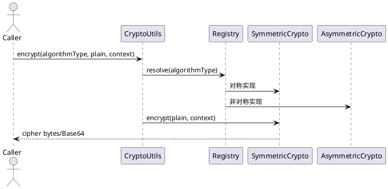
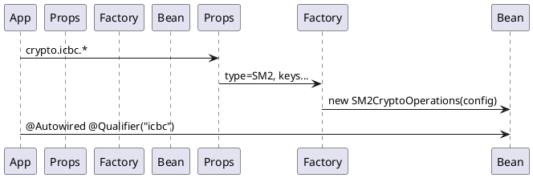

# wvframework-crypto 加密组件 - 开发详细设计文档

> **创建时间**: 2026-03-18  
> **技术栈**: Java 8+、Spring Boot 2.x/3.x、BouncyCastle（国密 SM2/SM3/SM4 等，可选）

---

## 1 模块概述

### 1.1 模块名称

**wvframework-crypto**（建议新增子模块，与 `wvframework-validation`、`wvframework-json` 等并列）

### 1.2 模块定位

提供可配置的**对称加密**、**非对称加密**及**数字签名/验签**能力；支持 JDK 标准算法与国密算法（依赖 BouncyCastle Provider）；提供**按算法封装的默认工具类**、**统一入口 CryptoUtils**，以及 **Spring Boot 按配置装配命名 Bean**（如工行场景 `crypto.icbc.algo.type=SM2`）。

### 1.3 关联模块

| 关联方 | 说明 |
|--------|------|
| 业务应用 | 注入 `CryptoOperations` 或具体命名 Bean 完成加解密、验签 |
| wvframework-core（可选） | 可复用统一异常基类（若项目已有） |

---

## 2 功能要求

### 2.1 功能要求

| 编号 | 要求 | 说明 |
|------|------|------|
| F1 | 常用对称算法 | AES（128/192/256）、DES、3DES、**SM4**（国密） |
| F2 | 常用非对称算法 | RSA、**SM2**（国密）、EC（可选，如 secp256r1） |
| F3 | 可配置参数 | 算法名、**工作模式**（ECB/CBC/CTR/GCM 等）、**填充**（PKCS5Padding、PKCS7、NoPadding、OAEP 等）、IV/Nonce、密钥长度、签名算法（如 SHA256withRSA、SM3withSM2） |
| F4 | 每算法独立工具类 | 固定**默认配置**，提供 `encrypt` / `decrypt`；非对称另提供 `sign` / `verify`（对称算法工具类中验签方法可定义为“不支持”并抛明确异常，或仅实现空实现——**推荐对称类只含加解密，签名统一在非对称工具类**） |
| F5 | 通用工具类 CryptoUtils | 与单算法工具能力一致，**增加算法类型（或配置键）参数**，委托对应实现 |
| F6 | Spring Boot 集成 | 通过配置（如 `crypto.icbc.algo.type=SM2`）生成**可注入的加密实例 Bean**，支持多命名空间（icbc、abc 等多套密钥与算法） |

### 2.2 非功能要求

| 项 | 要求 |
|----|------|
| 安全 | 密钥不落日志；敏感入参禁止 `JSON.toJSONString` 全量打印 |
| 异常 | 封装为带 cause 的运行时异常（如 `CryptoException`），保留原始栈 |
| 线程安全 | 无状态实现；`Cipher` 等非线程安全对象按调用创建或使用 ThreadLocal（实现阶段二选一并文档说明） |
| 扩展 | 新增算法通过实现统一接口 + 注册表，尽量不修改 CryptoUtils 分支爆炸 |

---

## 3 主要流程图（PlantUML）

### 3.1 加解密调用关系



### 3.2 Spring Boot 装配命名 Bean



---

## 4 接口设计

### 4.0 任务接口映射表

| 任务ID | 任务名称 | 接口类型 | 接口章节 | 接口名称 | 备注 |
|--------|----------|----------|----------|----------|------|
| CRYPTO-001 | 核心抽象与配置模型 | 内部 API | 4.1 | `CryptoOperations` / `CryptoContext` / `CryptoProperties` | 无 HTTP |
| CRYPTO-002 | 通用入口 | 内部 API | 4.2 | `CryptoUtils` | 静态/门面 |
| CRYPTO-003 | 各算法工具类 | 内部 API | 4.3 | `AesCryptoUtils` 等 | 默认配置 |
| CRYPTO-004 | Spring 自动配置 | 配置/Bean | 4.4 | `CryptoAutoConfiguration` | 多实例 Bean |

---

### 4.1 核心能力接口与配置（关联任务：CRYPTO-001）

**类型**：内部调用接口（Java API）  
**文件位置**：`wvframework-crypto/src/main/java/.../crypto/api/CryptoOperations.java`  
**关联任务**：CRYPTO-001

**接口说明**：  
- **所有加解密、签名、验签方法的密钥与算法参数均通过 `CryptoContext` 传入**（不再单独传 `CryptoKeyMaterial` + 分散 IV/模式等）。  
- **对称**：从 `CryptoConfigurations` 取 mode、iv、blockSize 等，从 **`CryptoContext.symmetricKeyLoader`** 取对称密钥。  
- **非对称**：加密/验签用 **`publicKeyLoader`**，解密/签名用 **`privateKeyLoader`**。  
- `CryptoContext` **固定包含三个密钥加载器成员**（均可为 null，按算法分支选用）：公钥、私钥、对称密钥。

---

#### `CryptoConfigurations`（算法与分组参数）

文件位置建议：`.../crypto/model/CryptoConfigurations.java`。

| 属性 | Java 类型 | 必填性 | 说明 |
|------|-----------|--------|------|
| algorithm | String | 是 | 如 AES、SM4、RSA、SM2、DES、DESede |
| transformation | String | 条件 | 完整 JDK 变换名；若为空则由 algorithm + mode + padding 拼接 |
| mode | String | 否 | ECB、CBC、CTR、GCM 等；与 transformation 二选一或互斥校验 |
| padding | String | 否 | PKCS5Padding、PKCS7、NoPadding、OAEP 等 |
| blockSize | Integer | 否 | 分组长度提示（字节）；部分算法/模式用于校验或缓冲区策略 |
| iv | `byte[]` | 条件 | 初始化向量；CBC 等必填；ECB/GCM 的 nonce 可用同字段或见 nonce |
| nonce | `byte[]` | 条件 | GCM 等模式的 nonce；与 iv 择一或并存按实现约定 |
| signatureAlgorithm | String | 条件 | 签名验签：如 SHA256withRSA、SM3withSM2 |
| provider | String | 否 | 如 BC |
| sm2UserId | `byte[]` / String | 否 | 国密 SM2 签名 userId，与对端约定 |
| oaepHash | String | 否 | RSA OAEP 时 MGF1 摘要名等 |
| extended | `Map<String, Object>` | 否 | 其它扩展参数 |

---

#### 密钥加载器（接口）

| 接口 | 职责 | 典型实现 |
|------|------|----------|
| **PublicKeyLoader** | 加载 `PublicKey`（或 SM2 公钥封装） | PEM 路径、classpath、KMS |
| **PrivateKeyLoader** | 加载 `PrivateKey` | PEM、PKCS#12、KMS |
| **SymmetricKeyLoader** | 加载对称密钥（`SecretKey` 或密钥字节） | 挂在 **`CryptoContext.symmetricKeyLoader`**，供 AES/SM4/DES 等使用 |

---

#### `CryptoContext`（一次操作的完整上下文）

文件位置建议：`.../crypto/model/CryptoContext.java`（不可变 Builder；**禁止 `toString` 打印密钥与 IV**）。

**三个密钥加载器**（结构上均存在；未参与当前算法时可为 **null** 或 **NoOp 空实现**，由实现约定）：

| 属性 | Java 类型 | 必填性 | 说明 |
|------|-----------|--------|------|
| publicKeyLoader | PublicKeyLoader | 条件 | **非对称**：加密、验签时使用 |
| privateKeyLoader | PrivateKeyLoader | 条件 | **非对称**：解密、签名时使用 |
| symmetricKeyLoader | SymmetricKeyLoader | 条件 | **对称**：AES/SM4/DES 加解密时使用 |
| configurations | CryptoConfigurations | 是 | algorithm、**mode**、**iv**、**blockSize**、padding、signatureAlgorithm 等（**不含**密钥加载器） |

**按算法的成员组合**

| 场景 | publicKeyLoader | privateKeyLoader | symmetricKeyLoader | configurations 要点 |
|------|-----------------|------------------|---------------------|---------------------|
| AES/SM4 加解密 | null（或可空） | null（或可空） | **必填** | mode、iv、blockSize 等 |
| RSA/SM2 公钥加密 | **必填** | null（或可空） | null（或可空） | algorithm/transformation 等 |
| RSA/SM2 私钥解密 | null（或可空） | **必填** | null（或可空） | 同上 |
| 签名 | null（或可空） | **必填** | null（或可空） | signatureAlgorithm |
| 验签 | **必填** | null（或可空） | null（或可空） | signatureAlgorithm |

**代码示例**：

```java
/**
 * 统一加解密与验签能力（内部 API）
 * 文件位置：crypto/api/CryptoOperations.java
 *
 * 核心逻辑：
 * 1. encrypt：从 configurations 取算法/模式/IV/blockSize；对称则用 symmetricKeyLoader，非对称则用 publicKeyLoader
 * 2. decrypt：对称则用 symmetricKeyLoader，非对称则用 privateKeyLoader
 * 3. sign：privateKeyLoader + signatureAlgorithm
 * 4. verify：publicKeyLoader + signatureAlgorithm
 */
public interface CryptoOperations {

    byte[] encrypt(byte[] plain, CryptoContext context);

    byte[] decrypt(byte[] cipher, CryptoContext context);

    byte[] sign(byte[] data, CryptoContext context);

    boolean verify(byte[] data, byte[] signature, CryptoContext context);
}
```

---

### 4.2 CryptoUtils 通用工具类（关联任务：CRYPTO-002）

**类型**：内部调用接口（静态门面）  
**文件位置**：`wvframework-crypto/src/main/java/.../crypto/CryptoUtils.java`  
**关联任务**：CRYPTO-002

**接口说明**：与各算法工具类能力对齐，**第一个参数为算法类型**（枚举 `CryptoAlgorithmType`）；**第二个参数为数据，第三个参数为 `CryptoContext`**（内含加载器与 `CryptoConfigurations`）。

**方法要点**：

| 方法 | 说明 |
|------|------|
| encrypt(type, plain, context) | context 中已含加载器与 mode/iv/blockSize 等 |
| decrypt(type, cipher, context) | 同上 |
| sign / verify | context 须含对应私钥/公钥加载器及 signatureAlgorithm |

**代码示例**：

```java
/**
 * 通用加密入口（静态工具）
 * 文件位置：crypto/CryptoUtils.java
 *
 * 核心逻辑：
 * 1. 根据 CryptoAlgorithmType 解析 CryptoOperations
 * 2. 委托 encrypt/decrypt/sign/verify，入参统一为 CryptoContext
 */
public final class CryptoUtils {

    public static byte[] encrypt(CryptoAlgorithmType type, byte[] plain, CryptoContext context);

    public static byte[] decrypt(CryptoAlgorithmType type, byte[] cipher, CryptoContext context);

    public static byte[] sign(CryptoAlgorithmType type, byte[] data, CryptoContext context);

    public static boolean verify(CryptoAlgorithmType type, byte[] data, byte[] signature, CryptoContext context);
}
```

---

### 4.3 各算法默认工具类（关联任务：CRYPTO-003）

**类型**：内部调用接口  
**文件位置**：`wvframework-crypto/src/main/java/.../crypto/algorithm/`  
**关联任务**：CRYPTO-003

**约定**：每个类提供 **默认 `CryptoConfigurations` 工厂方法**（如默认 mode、iv 策略、blockSize）及 **默认加载器占位**；静态方法入参统一为 **`CryptoContext`**（调用方组装加载器 + configurations），或与 `CryptoUtils` 一样增加 `type` 参数的重载。

| 类名 | 默认场景摘要 |
|------|----------------|
| AesCryptoUtils | AES，默认如 256 + CBC + PKCS5Padding |
| DesCryptoUtils | DES/3DES 默认配置（文档写明固定 transformation） |
| RsaCryptoUtils | RSA，默认 PKCS#1 v1.5 或 OAEP（择一并写死） |
| Sm2CryptoUtils | SM2 加解密 + SM3withSM2 签名验签 |
| Sm4CryptoUtils | SM4 默认模式与填充 |

**代码示例**：

```java
/**
 * AES 工具类
 * 文件位置：crypto/algorithm/AesCryptoUtils.java
 *
 * 核心逻辑：从 context.configurations 读取 mode、iv、blockSize；从 context.symmetricKeyLoader 取密钥，完成加解密
 */
public final class AesCryptoUtils {
    public static CryptoConfigurations defaultConfigurations();
    public static byte[] encrypt(byte[] plain, CryptoContext context);
    public static byte[] decrypt(byte[] cipher, CryptoContext context);
}
```

```java
/**
 * SM2 工具类（非对称 + 国密签名）
 * 文件位置：crypto/algorithm/Sm2CryptoUtils.java
 */
public final class Sm2CryptoUtils {
    public static byte[] encrypt(byte[] plain, CryptoContext context);
    public static byte[] decrypt(byte[] cipher, CryptoContext context);
    public static byte[] sign(byte[] data, CryptoContext context);
    public static boolean verify(byte[] data, byte[] signature, CryptoContext context);
}
```

---

### 4.4 Spring Boot 配置与 Bean 装配（关联任务：CRYPTO-004）

**类型**：配置驱动 Bean（非 HTTP）  
**文件位置**：  
- `.../crypto/autoconfigure/CryptoProperties.java`  
- `.../crypto/autoconfigure/CryptoAutoConfiguration.java`  
**关联任务**：CRYPTO-004

**配置示例**（支持多命名空间，与用户需求一致）：

```yaml
crypto:
  instances:
    icbc:
      algo:
        type: SM2    # 枚举：AES, SM4, RSA, SM2, DES, DESede ...
      configurations:
        mode: CBC
        block-size: 16
        iv: ...            # 或运行时注入
        signature-algorithm: SM3withSM2
      loaders:
        public-key-pem: | ...
        private-key-pem: | ...
        symmetric-key-ref: ""          # 非对称场景可空；对称场景填密钥引用
    otherChannel:
      algo:
        type: AES
      configurations:
        mode: GCM
        block-size: 16
      loaders:
        public-key-pem: ""
        private-key-pem: ""
        symmetric-key-ref: base64:...  # 对称场景映射为 SymmetricKeyLoader；公钥私钥可空
```

**等价 properties**：

```properties
crypto.instances.icbc.algo.type=SM2
crypto.instances.icbc.configurations.signature-algorithm=SM3withSM2
```

说明：用户提到的 `crypto.icbc.algo.type=SM2` 可通过 **宽松绑定** 映射为 `crypto.instances.icbc` 或直接在 `CryptoProperties` 中使用 `Map<String, InstanceConfig> icbc` 扁平键——**推荐统一为 `crypto.instances.<name>.*`，并支持别名 `crypto.icbc.*` 通过 `@ConfigurationProperties(prefix = "crypto")` 内嵌静态类 `Icbc` 兼容（二选一在实现阶段固定一种并写进 README）**。

**Bean 定义**：

- 每个命名实例生成一个 `CryptoOperations` Bean，`@Qualifier` 为实例名（如 `icbc`）。  
- 另可提供 `@Primary` 的默认 Bean（`crypto.default-instance=icbc`）。

**代码示例**：

```java
/**
 * 自动配置：按 crypto.instances 注册多个 CryptoOperations Bean
 * 文件位置：crypto/autoconfigure/CryptoAutoConfiguration.java
 *
 * 核心逻辑：
 * 1. 读取每个 instance 的 algo.type、configurations、PEM 等
 * 2. 装配 PublicKeyLoader / PrivateKeyLoader / SymmetricKeyLoader 与 CryptoConfigurations，封装为 CryptoContext 模板或 CryptoOperations
 * 3. @Bean 注册 CryptoOperations，业务调用时拷贝/派生 CryptoContext（或 Operations 内部已绑定加载器）
 */
@Configuration
@EnableConfigurationProperties(CryptoProperties.class)
public class CryptoAutoConfiguration {
    // @Bean @Qualifier("icbc") CryptoOperations icbcCrypto(...) 等
}
```

```java
/**
 * 业务侧注入示例
 * 文件位置：业务 Service
 */
// @Autowired @Qualifier("icbc") CryptoOperations icbcCrypto;
```

**META-INF/spring/org.springframework.boot.autoconfigure.AutoConfiguration.imports** 中注册 `CryptoAutoConfiguration`。

---

## 5 业务逻辑设计

### 5.1 算法注册与解析

1. 维护 `CryptoAlgorithmType` 枚举与 `CryptoOperations` 实现类的映射（或 SPI）。  
2. `CryptoUtils` 与各命名 Bean 共用 `DefaultCryptoOperations`，按 `CryptoContext` 运行时解析加载器与 `CryptoConfigurations`。  
3. 国密算法加载 **BouncyCastle Provider**（`Security.addProvider` 或在创建 Cipher 时指定 Provider）。

### 5.2 对称加解密流程

1. 按算法从 `CryptoContext` 的 **symmetricKeyLoader** 或 **publicKeyLoader/privateKeyLoader** 得到密钥，校验长度与 algorithm 匹配。  
2. 根据 `CryptoConfigurations` 拼接 `transformation`（mode、padding、blockSize 参与校验）。  
3. 使用 configurations 中的 iv/nonce（ECB 不传 IV）。  
4. 异常统一包装为 `CryptoException`。

### 5.3 非对称加密与签名

1. RSA/SM2 加密仅适用于长度受限明文；大块数据建议 **对称加密 + RSA/SM2 加密会话密钥**（可在文档“扩展建议”中说明，本组件可提供 `encryptKeyWithPublicKey` 辅助方法作为后续任务）。  
2. 验签：`verify` 返回 boolean；日志不打印私钥与完整明文。

### 5.4 配置与密钥加载

1. 配置绑定为 **PublicKeyLoader / PrivateKeyLoader / SymmetricKeyLoader** 的具体实现（PEM 路径、KMS 等）。  
2. 生产环境密钥不落配置文件明文时，加载器对接 KMS。

---

## 6 数据模型设计

本组件**不涉及业务数据库表**；无 ORM 实体。若后续增加“密钥版本表”，另起需求设计。

**改动点说明**：

- 无新增表、无修改表。  
- 配置项属于应用配置（YAML/Properties），非库表。

---

## 7 注意事项

1. **Java 加密强度**：AES-256 可能需 JCE 无限制策略（低版本 JDK）；文档注明 JDK 版本要求。  
2. **ECB 模式**：默认工具类避免默认 ECB；若提供 DES 默认 ECB，须在文档标注安全风险。  
3. **与 @Transactional 同方法**：本组件无事务；若业务在事务方法内调用加解密，注意性能与锁无关。  
4. **日志规范**：禁止在异常或日志中输出密钥、IV、完整密文（可打长度或 hash）。  
5. **依赖**：`wvframework-crypto` 对 BouncyCastle 使用 **optional** 或 **provided**，避免强制传递；国密功能文档说明需添加 `bcprov-jdk18on` 等坐标。

---

## 8 依赖任务

### 8.1 前置依赖

- 父 POM 中增加子模块 `wvframework-crypto`。  
- 确定 JDK 与 Spring Boot 主版本与现有 components 一致。

### 8.2 后置依赖

- 各业务模块按需引入 `wvframework-crypto`，配置 `crypto.instances.*`。  
- 单元测试：向量测试（AES/RSA）与国密样本（SM2/SM4）用例。

### 8.3 任务与交付物对照

| 任务ID | 交付物 |
|--------|--------|
| CRYPTO-001 | `CryptoOperations`、`CryptoContext`、`CryptoConfigurations`、`PublicKeyLoader`、`PrivateKeyLoader`、`SymmetricKeyLoader`、`CryptoException` |
| CRYPTO-002 | `CryptoUtils`、`CryptoAlgorithmType`、`AlgorithmRegistry` |
| CRYPTO-003 | `AesCryptoUtils`、`RsaCryptoUtils`、`Sm2CryptoUtils`、`Sm4CryptoUtils`、`DesCryptoUtils` 等 |
| CRYPTO-004 | `CryptoProperties`、`CryptoAutoConfiguration`、`spring.factories`/`imports`、README 配置说明 |

---

**文档结束**
