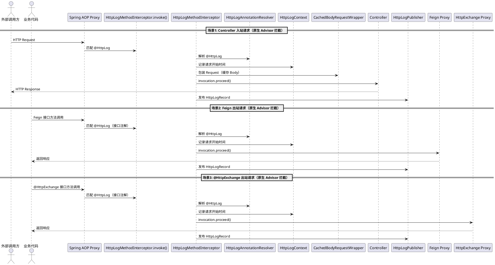
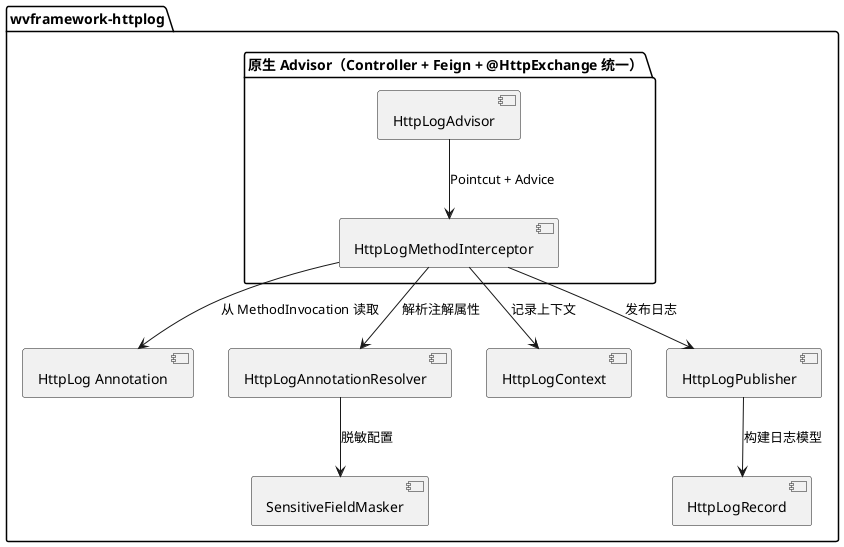

# wvframework-httplog HTTP 请求日志组件 - 开发设计文档

> **创建时间**: 2026-07-25  
> **技术栈**: Java 17+、Spring Boot 3.x、Spring Cloud OpenFeign、Spring Framework 6.x `@HttpExchange`

---

## 1 模块概述

### 1.1 模块名称

**wvframework-httplog**（建议新增子模块，与 `wvframework-feign`、`wvframework-core` 等并列）

### 1.2 模块定位

提供统一的 **HTTP 请求日志记录** 能力，支持以下三种请求场景的拦截与日志记录：

1. **Feign 客户端请求** — 拦截 Spring Cloud OpenFeign 的远程调用
2. **@HttpExchange 接口请求** — 拦截 Spring Framework 6.x 声明式 HTTP 客户端（`@HttpExchange` 接口方法）
3. **Controller 入口请求** — 拦截 Spring MVC 的 Controller 方法入口

通过自定义注解 **`@HttpLog`** 实现**精细化控制**，可标注在：
- Controller 类的方法上（拦截该接口的入站请求）
- Feign Client 的 facade 方法上（拦截该 Feign 调用的出站请求）
- `@HttpExchange` 接口的方法上（拦截该声明式 HTTP 调用的出站请求）

### 1.3 关联模块

| 关联方 | 说明 |
|--------|------|
| wvframework-feign | 复用现有 Feign 配置体系，扩展 Feign 拦截器 |
| wvframework-core | 复用线程池、事件发布等基础能力 |
| wvframework-annotations | 注解设计参考（`@EnumField`、`@Pojo` 等） |
| 业务应用 | 在 Controller 方法或 Feign Client 方法上添加 `@HttpLog` 即可启用 |

---

## 2 功能要求

### 2.1 功能要求

| 编号 | 要求 | 说明 |
|------|------|------|
| F1 | `@HttpLog` 注解 | 可标注在 Controller 方法、Feign Client 方法和 `@HttpExchange` 接口方法上，支持配置日志级别、是否记录请求体/响应体、脱敏字段等 |
| F2 | Feign 请求拦截 | 通过原生 Advisor + MethodInterceptor 拦截 Feign 出站请求，记录请求 URL、方法、Header、Body、响应状态码、耗时等 |
| F3 | @HttpExchange 拦截 | 通过原生 Advisor + MethodInterceptor 拦截 `@HttpExchange` 接口出站请求，与 Feign 共用同一套拦截逻辑 |
| F4 | Controller 请求拦截 | 通过原生 Advisor + MethodInterceptor 拦截入站请求，记录请求完整信息 |
| F5 | 统一日志模型 | 三种场景共用统一的日志数据模型 `HttpLogRecord`，包含请求/响应全量信息 |
| F6 | 日志输出策略 | 默认使用数据库持久化（`DatabaseHttpLogPublisher`），同时提供 SPI 接口 `HttpLogPublisher` 支持扩展（如发 MQ、上报 APM） |
| F7 | 请求体/响应体记录 | 可选记录请求体和响应体内容，支持长度截断、JSON 脱敏；额外记录解密后的明文（`requestBodyPlain` / `responseBodyPlain`），便于阅读 |
| F8 | 全局开关与注解覆盖 | 支持全局配置开关（`wv.httplog.enabled`），注解属性可覆盖全局配置 |
| F9 | 明文字段手动赋值 | 提供 `HttpLogContext.setResponseBodyPlain()` 等方法，允许业务代码在解密后手动赋值得到明文 |
| F10 | 跨线程支持 | `HttpLogContext` 支持 `InheritableThreadLocal` 模式，确保异步子线程中也能读取和赋值日志上下文 |

### 2.2 非功能要求

| 项 | 要求 |
|----|------|
| 性能 | 日志记录不阻塞主请求流程；请求体/响应体的读取使用流包装，避免内存溢出 |
| 安全 | 敏感字段（如密码、token）自动脱敏；日志中不输出完整密钥 |
| 线程安全 | 无状态拦截器设计；上下文信息通过 `InheritableThreadLocal` 传递，支持跨线程场景 |
| 扩展性 | 日志输出、脱敏策略、持久化方式均通过接口扩展 |
| 兼容性 | 兼容 Spring MVC（Servlet）场景；@HttpExchange 场景需 Spring Framework 6.0+ |

---

## 3 整体架构设计

### 3.1 模块内部结构

```
wvframework-httplog/
└── src/main/java/com/github/walkvoid/wvframework/httplog/
    ├── annotation/
    │   └── HttpLog.java                        # 核心注解
    ├── model/
    │   ├── HttpLogRecord.java                  # 统一日志记录模型
    │   ├── HttpLogType.java                    # 日志类型枚举（INBOUND/OUTBOUND）
    │   └── HttpLogProperties.java              # 配置属性类
    ├── context/
    │   └── HttpLogContext.java                 # 日志上下文（InheritableThreadLocal，支持跨线程）
    ├── resolver/
    │   ├── HttpLogAnnotationResolver.java      # 注解属性解析器
    │   └── SensitiveFieldMasker.java           # 敏感字段脱敏器
    ├── advisor/
    │   ├── HttpLogAdvisor.java                 # 原生 Advisor（Pointcut + Advice）
    │   ├── HttpLogMethodInterceptor.java       # 核心 MethodInterceptor（统一拦截逻辑）
    │   └── CachedBodyRequestWrapper.java       # 请求体可重复读包装
    ├── mapper/
    │   └── HttpLogMapper.java                  # MyBatis Mapper（http_access_log 表）
    ├── publisher/
    │   ├── HttpLogPublisher.java               # 日志发布器接口（SPI）
    │   ├── DatabaseHttpLogPublisher.java       # 默认实现：数据库持久化
    │   └── CompositeHttpLogPublisher.java      # 组合发布器
    ├── autoconfigure/
    │   └── HttpLogAutoConfiguration.java       # Spring Boot 自动配置
    └── util/
        └── HttpLogUtils.java                   # 工具类
```

### 3.2 核心拦截原理（原生 Advisor 方式）

本组件采用与 Spring `@CachePut` 相同的**原生 Advisor + MethodInterceptor** 机制，而非 `@Aspect` 注解式切面。

**核心思路**：

1. 定义 `HttpLogAdvisor`（包含 `AnnotationMatchingPointcut` + `HttpLogMethodInterceptor`）
2. `AnnotationMatchingPointcut(null, HttpLog.class, true)` 匹配所有标注了 `@HttpLog` 的方法（第三个参数 `true` 表示同时检查接口上的注解）
3. `HttpLogMethodInterceptor` 实现 `org.aopalliance.intercept.MethodInterceptor`，在 `invoke(MethodInvocation)` 中统一处理 Controller 入站请求、Feign 出站请求和 `@HttpExchange` 出站请求
4. 由 Spring AOP 自动为匹配的 Bean 创建代理，无需 AspectJ 织入

**优势**：
- 与 Spring 代理模型天然兼容，无需 AspectJ 编译器
- Controller、Feign 和 `@HttpExchange` 共用同一套拦截逻辑，代码统一
- `AnnotationMatchingPointcut` 的 `checkInherited = true` 天然支持 Feign 接口和 `@HttpExchange` 接口方法上的注解

### 3.3 三种拦截场景流程图



### 3.4 核心组件关系



---

## 4 接口设计

### 4.0 任务接口映射表

| 任务ID | 任务名称 | 接口类型 | 接口章节 | 接口名称 | 备注 |
|--------|----------|----------|----------|----------|------|
| HTTPLOG-001 | `@HttpLog` 注解定义 | 注解 | 4.1 | `HttpLog` | 核心注解 |
| HTTPLOG-002 | 统一日志模型 | 内部 API | 4.2 | `HttpLogRecord` / `HttpLogType` | 数据模型 |
| HTTPLOG-003 | 日志上下文 | 内部 API | 4.3 | `HttpLogContext` | InheritableThreadLocal，支持跨线程明文赋值 |
| HTTPLOG-004 | 原生 Advisor + MethodInterceptor | 核心拦截器 | 4.4 | `HttpLogAdvisor` / `HttpLogMethodInterceptor` | 统一拦截 Controller + Feign + @HttpExchange |
| HTTPLOG-006 | 日志发布器 | SPI | 4.6 | `HttpLogPublisher` | 可扩展输出 |
| HTTPLOG-007 | 自动配置与属性 | 配置 | 4.7 | `HttpLogAutoConfiguration` / `HttpLogProperties` | Spring Boot 集成 |

---

### 4.1 `@HttpLog` 注解定义（关联任务：HTTPLOG-001）

**类型**：注解  
**文件位置**：`wvframework-httplog/src/main/java/.../httplog/annotation/HttpLog.java`  
**关联任务**：HTTPLOG-001

**注解说明**：

| 属性 | 类型 | 默认值 | 说明 |
|------|------|--------|------|
| value | String | `""` | 日志描述/业务标识，如 `"查询用户信息"` |
| enabled | boolean | `true` | 是否启用日志记录（可覆盖全局开关） |
| logRequest | boolean | `true` | 是否记录请求信息（URL、Header、参数） |
| logRequestBody | boolean | `true` | 是否记录请求体内容 |
| logResponseBody | boolean | `true` | 是否记录响应体内容 |
| logLevel | LogLevel | `LogLevel.INFO` | 日志级别（TRACE/DEBUG/INFO/WARN/ERROR） |
| maxBodyLength | int | `2048` | 请求体/响应体最大记录长度（字符），超出截断 |
| excludeHeaders | String[] | `{}` | 不记录到日志的 Header 名称（如 Authorization） |
| maskFields | String[] | `{}` | 需要脱敏的 JSON 字段名（如 `"password"`, `"token"`） |
| slowThreshold | long | `3000` | 慢请求阈值（毫秒），超过此阈值以 WARN 级别记录 |

**目标（Target）**：`METHOD`（支持标注在方法上）  
**保留策略**：`RUNTIME`

#### `LogLevel`（日志级别枚举）

| 值 | 说明 |
|------|------|
| TRACE | 最细粒度，记录完整请求/响应细节 |
| DEBUG | 调试级别，记录请求摘要信息 |
| INFO | 默认级别，记录请求基本信息和状态码 |
| WARN | 告警级别，用于慢请求记录 |
| ERROR | 错误级别，用于异常请求记录 |

**代码示例**：

```java
/**
 * HTTP 请求日志注解
 * 文件位置：httplog/annotation/HttpLog.java
 *
 * 可标注在：
 * 1. Controller 方法 — 记录入站请求
 * 2. Feign Client 方法 — 记录出站请求
 * 3. @HttpExchange 接口方法 — 记录声明式 HTTP 出站请求
 */
@Target(ElementType.METHOD)
@Retention(RetentionPolicy.RUNTIME)
@Documented
public @interface HttpLog {

    /** 日志描述/业务标识 */
    String value() default "";

    /** 是否启用 */
    boolean enabled() default true;

    /** 是否记录请求信息 */
    boolean logRequest() default true;

    /** 是否记录请求体 */
    boolean logRequestBody() default true;

    /** 是否记录响应体 */
    boolean logResponseBody() default true;

    /** 日志级别 */
    LogLevel logLevel() default LogLevel.INFO;

    /** 请求体/响应体最大记录长度 */
    int maxBodyLength() default 2048;

    /** 不记录的 Header */
    String[] excludeHeaders() default {};

    /** 需要脱敏的字段名 */
    String[] maskFields() default {};

    /** 慢请求阈值（毫秒） */
    long slowThreshold() default 3000;
}
```

**使用示例**：

```java
// ========== 示例1: 标注在 Controller 方法上 ==========
@RestController
@RequestMapping("/api/users")
public class UserController {

    @HttpLog(value = "查询用户列表", slowThreshold = 1000)
    @GetMapping
    public Result<List<UserVO>> listUsers(UserQueryDTO query) {
        // ...
    }

    @HttpLog(value = "创建用户", logRequestBody = true, maskFields = {"password"})
    @PostMapping
    public Result<UserVO> createUser(@RequestBody CreateUserDTO dto) {
        // ...
    }
}

// ========== 示例2: 标注在 Feign Client 方法上 ==========
@FeignClient(name = "user-service", path = "/api/users")
public interface UserFeignClient {

    @HttpLog(value = "Feign-查询用户", slowThreshold = 2000)
    @GetMapping("/{id}")
    Result<UserDTO> getUserById(@PathVariable("id") Long id);

    @HttpLog(value = "Feign-创建用户", maskFields = {"password"})
    @PostMapping
    Result<UserDTO> createUser(@RequestBody CreateUserDTO dto);
}

// ========== 示例3: 标注在 @HttpExchange 接口方法上 ==========
// Spring Framework 6.x 声明式 HTTP 客户端，与 Feign 一样由 JDK 动态代理创建
// 原生 Advisor 天然支持拦截，可直接在接口方法上标注 @HttpLog
@HttpExchange(url = "http://user-service/api/users")
public interface UserHttpApi {

    @HttpLog(value = "HttpExchange-查询用户", slowThreshold = 2000)
    @GetExchange("/{id}")
    Result<UserDTO> getUserById(@PathVariable("id") Long id);

    @HttpLog(value = "HttpExchange-创建用户", maskFields = {"password"})
    @PostExchange
    Result<UserDTO> createUser(@RequestBody CreateUserDTO dto);

    @HttpLog(value = "HttpExchange-加密接口")
    @PostExchange("/secure")
    Result<String> callEncrypted(@RequestBody String encryptedBody);
}

// 注册 @HttpExchange 接口为 Spring Bean（在 @Configuration 类中）
@Configuration
public class HttpApiConfiguration {

    @Bean
    public UserHttpApi userHttpApi(WebClient.Builder webClientBuilder) {
        WebClient webClient = webClientBuilder.baseUrl("http://user-service").build();
        return HttpServiceProxyFactory.builderFor(WebClientAdapter.create(webClient))
                .build()
                .createClient(UserHttpApi.class);
    }
}
```

---

### 4.2 统一日志模型（关联任务：HTTPLOG-002）

**类型**：内部数据模型  
**文件位置**：`wvframework-httplog/src/main/java/.../httplog/model/`  
**关联任务**：HTTPLOG-002

#### `HttpLogType`（日志类型枚举）

| 值 | 说明 |
|----|------|
| INBOUND | 入站请求（Controller 接收到的请求） |
| OUTBOUND | 出站请求（Feign / @HttpExchange 发出的请求） |

#### `HttpLogRecord`（统一日志记录）

| 属性 | Java 类型 | 说明 |
|------|-----------|------|
| logId | String | 日志唯一 ID（UUID） |
| traceId | String | 链路追踪 ID（从 MDC 或 Header 获取） |
| type | HttpLogType | INBOUND / OUTBOUND |
| description | String | 注解 `@HttpLog` 的 value 描述 |
| httpMethod | String | HTTP 方法（GET/POST/PUT/DELETE 等） |
| url | String | 请求 URL（含查询参数） |
| requestHeaders | Map<String, String> | 请求头（已排除敏感 Header） |
| requestBody | String | 请求体（已截断、已脱敏，可能是加密后的密文） |
| requestBodyPlain | String | 解密得到的请求明文（由业务代码通过 `HttpLogContext` 手动赋值，可为 null） |
| responseStatus | int | 响应状态码 |
| responseHeaders | Map<String, String> | 响应头 |
| responseBody | String | 响应体（已截断、已脱敏，可能是加密后的密文） |
| responseBodyPlain | String | 解密得到的响应明文（由业务代码通过 `HttpLogContext` 手动赋值，可为 null） |
| duration | long | 请求耗时（毫秒） |
| slow | boolean | 是否为慢请求（超过阈值） |
| clientName | String | 服务名（Feign 场景为 FeignClient name） |
| methodSignature | String | 方法签名（类名.方法名） |
| timestamp | LocalDateTime | 请求开始时间 |
| exception | String | 异常信息（如有） |

**代码示例**：

```java
/**
 * 统一 HTTP 日志记录模型
 * 文件位置：httplog/model/HttpLogRecord.java
 */
public class HttpLogRecord {
    private String logId;
    private String traceId;
    private HttpLogType type;
    private String description;
    private String httpMethod;
    private String url;
    private Map<String, String> requestHeaders;
    private String requestBody;
    private String requestBodyPlain;   // 解密得到的请求明文
    private int responseStatus;
    private Map<String, String> responseHeaders;
    private String responseBody;
    private String responseBodyPlain;  // 解密得到的响应明文
    private long duration;
    private boolean slow;
    private String clientName;
    private String methodSignature;
    private LocalDateTime timestamp;
    private String exception;

    // Builder 模式构建
    public static Builder builder() { return new Builder(); }
    // ... getter/setter/builder 省略
}
```

---

### 4.3 日志上下文（关联任务：HTTPLOG-003）

**类型**：内部 API  
**文件位置**：`wvframework-httplog/src/main/java/.../httplog/context/HttpLogContext.java`  
**关联任务**：HTTPLOG-003

**说明**：基于 `InheritableThreadLocal` 在请求生命周期内传递日志上下文信息（开始时间、注解配置、明文等），请求结束后自动清理。支持跨线程场景：当业务代码在异步子线程中调用 `HttpLogContext.setResponseBodyPlain()` 时，仍能正确赋值到父线程的上下文中。

**代码示例**：

```java
/**
 * HTTP 日志上下文（InheritableThreadLocal 传递，支持跨线程）
 * 文件位置：httplog/context/HttpLogContext.java
 *
 * 核心设计：
 * 1. 使用 InheritableThreadLocal 而非 ThreadLocal，子线程可继承父线程的上下文
 * 2. 提供 setRequestBodyPlain() / setResponseBodyPlain() 静态方法，
 *    业务代码在解密后手动调用，将明文写入当前上下文
 * 3. 拦截器在发布日志前，从上下文中读取明文并填充到 HttpLogRecord
 */
public class HttpLogContext {

    // 使用 InheritableThreadLocal 支持异步子线程继承
    private static final InheritableThreadLocal<HttpLogContext> HOLDER = new InheritableThreadLocal<>();

    private long startTime;
    private HttpLog annotation;
    private HttpLogRecord.HttpLogRecordBuilder recordBuilder;

    // ===== 明文字段（业务代码手动赋值） =====
    private String requestBodyPlain;    // 解密得到的请求明文
    private String responseBodyPlain;   // 解密得到的响应明文

    public static void set(HttpLogContext context) { HOLDER.set(context); }
    public static HttpLogContext get() { return HOLDER.get(); }
    public static void clear() { HOLDER.remove(); }

    /**
     * 业务代码调用：设置解密后的请求明文
     * 可在任意线程中调用（包括异步子线程）
     */
    public static void setRequestBodyPlain(String plain) {
        HttpLogContext ctx = HOLDER.get();
        if (ctx != null) {
            ctx.requestBodyPlain = plain;
        }
    }

    /**
     * 业务代码调用：设置解密后的响应明文
     * 可在任意线程中调用（包括异步子线程）
     */
    public static void setResponseBodyPlain(String plain) {
        HttpLogContext ctx = HOLDER.get();
        if (ctx != null) {
            ctx.responseBodyPlain = plain;
        }
    }

    public String getRequestBodyPlain() { return requestBodyPlain; }
    public String getResponseBodyPlain() { return responseBodyPlain; }

    // 其他 getter/setter 省略
}
```

**业务代码使用示例**：

```java
@RestController
public class SecureController {

    @HttpLog(value = "加密接口")
    @PostMapping("/secure/data")
    public Result<String> handleEncrypted(@RequestBody EncryptedDTO dto) {
        // 1. 解密请求体
        String plainText = cryptoUtils.decrypt(dto.getEncryptedBody());

        // 2. 手动赋值请求明文，日志中将记录解密后的内容
        HttpLogContext.setRequestBodyPlain(plainText);

        // 3. 业务处理...
        String responsePlain = doBusiness(plainText);

        // 4. 手动赋值响应明文
        HttpLogContext.setResponseBodyPlain(responsePlain);

        return Result.ok(cryptoUtils.encrypt(responsePlain));
    }
}
```

**跨线程场景示例**：

```java
@HttpLog(value = "异步处理接口")
@PostMapping("/async/process")
public Result<String> asyncProcess(@RequestBody RequestDTO dto) {
    // 主线程设置请求明文
    HttpLogContext.setRequestBodyPlain(decrypt(dto.getBody()));

    // 异步子线程中也能访问到父线程的 HttpLogContext
    CompletableFuture.supplyAsync(() -> {
        String result = process(dto);
        // 子线程中赋值响应明文，InheritableThreadLocal 保证能写入
        HttpLogContext.setResponseBodyPlain(result);
        return result;
    });

    return Result.ok();
}
```

---

### 4.4 原生 Advisor + MethodInterceptor（关联任务：HTTPLOG-004）

**类型**：Spring 原生 AOP（`Advisor` + `MethodInterceptor`）  
**文件位置**：`wvframework-httplog/src/main/java/.../httplog/advisor/`  
**关联任务**：HTTPLOG-004

**设计说明**：

采用与 Spring `@CachePut` 相同的原生切面机制，统一拦截 Controller 入站请求和 Feign 出站请求。核心由两个组件组成：

| 组件 | 职责 | 对应 Spring Cache |
|------|------|------------------|
| `HttpLogAdvisor` | 组装 Pointcut + Advice，注册为 Spring Bean | `BeanFactoryCacheOperationSourceAdvisor` |
| `HttpLogMethodInterceptor` | 实现 `MethodInterceptor`，在 `invoke()` 中执行日志记录逻辑 | `CacheInterceptor` |

**核心流程**：

```
方法调用（Controller 或 Feign 接口方法）
  → Spring AOP 代理检查：AnnotationMatchingPointcut 匹配 @HttpLog
  → HttpLogMethodInterceptor.invoke(MethodInvocation)
  → 从 Method 上读取 @HttpLog 注解属性
  → 判断请求类型（INBOUND / OUTBOUND）：
      - 若当前线程有 HttpServletRequest → Controller 入站
      - 否则 → Feign 出站
  → 记录请求信息（URL、Header、Body）
  → invocation.proceed() 执行目标方法
  → 记录响应信息、耗时
  → 构建 HttpLogRecord → 发布日志
```

**代码示例**：

```java
/**
 * HTTP 日志 Advisor
 * 文件位置：httplog/advisor/HttpLogAdvisor.java
 *
 * 类比 Spring Cache 的 BeanFactoryCacheOperationSourceAdvisor：
 * - Pointcut 匹配所有标注了 @HttpLog 的方法
 * - Advice 为 HttpLogMethodInterceptor
 */
public class HttpLogAdvisor extends AbstractPointcutAdvisor {

    private final Pointcut pointcut;
    private final MethodInterceptor advice;

    public HttpLogAdvisor(HttpLogMethodInterceptor interceptor) {
        // checkInherited = true：同时检查接口方法上的注解（Feign 场景）
        this.pointcut = new AnnotationMatchingPointcut(null, HttpLog.class, true);
        this.advice = interceptor;
    }

    @Override
    public Pointcut getPointcut() {
        return this.pointcut;
    }

    @Override
    public Advice getAdvice() {
        return this.advice;
    }
}
```

```java
/**
 * HTTP 日志 MethodInterceptor（核心拦截逻辑）
 * 文件位置：httplog/advisor/HttpLogMethodInterceptor.java
 *
 * 类比 Spring Cache 的 CacheInterceptor：
 * - 实现 org.aopalliance.intercept.MethodInterceptor
 * - 在 invoke() 中统一处理 Controller 和 Feign 场景
 *
 * 核心逻辑：
 * 1. 从 MethodInvocation.getMethod() 获取 @HttpLog 注解
 * 2. 解析注解属性，合并全局配置
 * 3. 判断请求类型（通过 RequestContextHolder 检测是否为 Controller 场景）
 * 4. Controller 场景：包装 Request/Response，记录入站日志
 * 5. Feign 场景：记录出站请求/响应
 * 6. 从 HttpLogContext 读取业务代码手动赋值的明文
 * 7. 构建 HttpLogRecord 并发布
 */
public class HttpLogMethodInterceptor implements MethodInterceptor {

    private final HttpLogPublisher publisher;
    private final HttpLogProperties properties;
    private final HttpLogAnnotationResolver resolver;
    private final SensitiveFieldMasker masker;

    @Override
    public Object invoke(MethodInvocation invocation) throws Throwable {
        Method method = invocation.getMethod();
        HttpLog httpLog = method.getAnnotation(HttpLog.class);

        if (httpLog == null || !httpLog.enabled()) {
            return invocation.proceed();
        }

        // 初始化日志上下文
        HttpLogContext context = new HttpLogContext();
        context.setStartTime(System.currentTimeMillis());
        context.setAnnotation(httpLog);
        HttpLogContext.set(context);

        long startTime = System.currentTimeMillis();
        HttpLogRecord.HttpLogRecordBuilder builder = HttpLogRecord.builder()
                .logId(UUID.randomUUID().toString())
                .methodSignature(invocation.getThis().getClass().getSimpleName()
                        + "." + method.getName())
                .description(httpLog.value())
                .timestamp(LocalDateTime.now());

        try {
            // 判断请求类型
            if (isControllerRequest()) {
                // ===== Controller 入站请求 =====
                handleInboundRequest(invocation, httpLog, builder);
            } else {
                // ===== Feign 出站请求 =====
                handleOutboundRequest(invocation, httpLog, builder);
            }

            // 执行目标方法
            Object result = invocation.proceed();

            // 记录响应信息
            long duration = System.currentTimeMillis() - startTime;
            builder.duration(duration);
            builder.slow(duration > httpLog.slowThreshold());
            builder.responseStatus(determineStatus(result));

            // 从 HttpLogContext 读取业务代码手动赋值的明文
            HttpLogContext context = HttpLogContext.get();
            if (context != null) {
                builder.requestBodyPlain(context.getRequestBodyPlain());
                builder.responseBodyPlain(context.getResponseBodyPlain());
            }

            // 发布日志
            publisher.publish(builder.build());

            return result;
        } catch (Throwable t) {
            // 异常场景也记录日志
            builder.exception(t.getClass().getName() + ": " + t.getMessage());
            builder.duration(System.currentTimeMillis() - startTime);
            // 异常时也读取明文
            HttpLogContext context = HttpLogContext.get();
            if (context != null) {
                builder.requestBodyPlain(context.getRequestBodyPlain());
                builder.responseBodyPlain(context.getResponseBodyPlain());
            }
            publisher.publish(builder.build());
            throw t;
        } finally {
            // 清理上下文，防止内存泄漏
            HttpLogContext.clear();
        }
    }

    private boolean isControllerRequest() {
        return RequestContextHolder.getRequestAttributes() != null;
    }

    private void handleInboundRequest(MethodInvocation invocation,
                                       HttpLog httpLog,
                                       HttpLogRecord.HttpLogRecordBuilder builder) {
        builder.type(HttpLogType.INBOUND);
        // 1. 从 RequestContextHolder 获取 HttpServletRequest
        // 2. 包装为 CachedBodyRequestWrapper（缓存 Body）
        // 3. 记录 URL、Method、Header、Body
        // 4. 使用 ContentCachingResponseWrapper 包装响应
    }

    private void handleOutboundRequest(MethodInvocation invocation,
                                        HttpLog httpLog,
                                        HttpLogRecord.HttpLogRecordBuilder builder) {
        builder.type(HttpLogType.OUTBOUND);
        // 1. 从方法参数和 @RequestMapping 注解解析目标 URL
        // 2. 记录请求信息
        // 3. 从 invocation.proceed() 的返回值解析响应
    }
}
```

```java
/**
 * 请求体可重复读包装
 * 文件位置：httplog/advisor/CachedBodyRequestWrapper.java
 *
 * 继承 HttpServletRequestWrapper，在构造时一次性读取并缓存请求体。
 * 后续 getInputStream() / getReader() 均从缓存读取。
 */
public class CachedBodyRequestWrapper extends HttpServletRequestWrapper {

    private final byte[] cachedBody;

    public CachedBodyRequestWrapper(HttpServletRequest request) throws IOException {
        super(request);
        this.cachedBody = StreamUtils.copyToByteArray(request.getInputStream());
    }

    @Override
    public ServletInputStream getInputStream() {
        return new CachedBodyServletInputStream(this.cachedBody);
    }

    @Override
    public BufferedReader getReader() {
        return new BufferedReader(new InputStreamReader(
                new ByteArrayInputStream(this.cachedBody), getCharacterEncoding()));
    }

    public byte[] getCachedBody() {
        return this.cachedBody;
    }
}
```

---

### 4.5 @HttpExchange 场景的统一拦截（关联任务：HTTPLOG-004）

**类型**：原生 Advisor（复用 HTTPLOG-004 的统一拦截器）  
**关联任务**：HTTPLOG-004（无独立组件，与 Feign 共用 `HttpLogAdvisor`）

**设计说明**：

Spring Framework 6.x 引入了 `@HttpExchange` 声明式 HTTP 客户端，通过接口 + 注解定义 HTTP 调用，由 `HttpServiceProxyFactory` 创建 JDK 动态代理。这与 Feign 的代理模型完全一致，因此**原生 Advisor 天然支持拦截**，无需独立的过滤器组件。

**拦截原理**：

1. `@HttpExchange` 接口方法上标注 `@HttpLog`
2. `HttpServiceProxyFactory.createClient()` 创建 JDK 动态代理
3. Spring 将 `HttpLogAdvisor` 织入代理，`HttpLogMethodInterceptor.invoke()` 被触发
4. `AnnotationMatchingPointcut(null, HttpLog.class, true)` 的 `checkInherited = true` 匹配接口方法上的 `@HttpLog`
5. 拦截器通过 `RequestContextHolder` 判断请求类型，此处为 OUTBOUND

**与 Feign 场景的对比**：

| 维度 | Feign | @HttpExchange |
|------|-------|---------------|
| 代理创建 | Spring Cloud OpenFeign JDK 代理 | HttpServiceProxyFactory JDK 代理 |
| 注解感知 | `checkInherited = true` 自动支持 | `checkInherited = true` 自动支持 |
| 拦截器 | 共用 `HttpLogMethodInterceptor` | 共用 `HttpLogMethodInterceptor` |
| 额外组件 | 无 | 无 |

**注册 @HttpExchange 接口 Bean 示例**：

```java
/**
 * @HttpExchange 接口 Bean 注册配置
 * 文件位置：业务应用 Configuration 类
 *
 * 通过 HttpServiceProxyFactory 将接口注册为 Spring Bean，
 * Spring 自动将 HttpLogAdvisor 织入代理，无需额外配置
 */
@Configuration
public class HttpApiConfiguration {

    @Bean
    public UserHttpApi userHttpApi(WebClient.Builder webClientBuilder) {
        WebClient webClient = webClientBuilder.baseUrl("http://user-service").build();
        return HttpServiceProxyFactory.builderFor(WebClientAdapter.create(webClient))
                .build()
                .createClient(UserHttpApi.class);
    }
}
```

---

### 4.6 日志发布器（关联任务：HTTPLOG-006）

**类型**：SPI 接口 + 默认实现  
**文件位置**：`wvframework-httplog/src/main/java/.../httplog/publisher/`  
**关联任务**：HTTPLOG-006

**接口说明**：

| 接口/类 | 职责 |
|---------|------|
| `HttpLogPublisher` | 日志发布接口（SPI），定义 `publish(HttpLogRecord)` 方法 |
| `DatabaseHttpLogPublisher` | **默认实现**，将日志持久化到数据库 `http_access_log` 表 |
| `CompositeHttpLogPublisher` | 组合模式，支持同时使用多个发布器 |

**代码示例**：

```java
/**
 * HTTP 日志发布器接口（SPI）
 * 文件位置：httplog/publisher/HttpLogPublisher.java
 *
 * 业务方可实现此接口扩展自定义日志持久化（如发 MQ、上报 APM）
 */
public interface HttpLogPublisher {
    void publish(HttpLogRecord record);
}
```

```java
/**
 * 数据库默认日志发布器（默认实现）
 * 文件位置：httplog/publisher/DatabaseHttpLogPublisher.java
 *
 * 核心逻辑：
 * 1. 将 HttpLogRecord 持久化到 http_access_log 表
 * 2. 支持异步写入（通过线程池）避免阻塞主请求
 * 3. 包含 requestBodyPlain / responseBodyPlain 明文字段的持久化
 */
public class DatabaseHttpLogPublisher implements HttpLogPublisher {

    private final HttpLogMapper httpLogMapper;
    private final Executor asyncExecutor;

    public DatabaseHttpLogPublisher(HttpLogMapper httpLogMapper) {
        this(httpLogMapper, Executors.newFixedThreadPool(
                Runtime.getRuntime().availableProcessors(),
                r -> {
                    Thread t = new Thread(r, "httplog-writer");
                    t.setDaemon(true);
                    return t;
                }));
    }

    public DatabaseHttpLogPublisher(HttpLogMapper httpLogMapper, Executor asyncExecutor) {
        this.httpLogMapper = httpLogMapper;
        this.asyncExecutor = asyncExecutor;
    }

    @Override
    public void publish(HttpLogRecord record) {
        // 异步写入数据库，不阻塞主请求流程
        asyncExecutor.execute(() -> httpLogMapper.insert(record));
    }
}
```

**自定义扩展示例**：

```java
/**
 * 业务自定义日志发布器（发 MQ 示例）
 */
@Component
public class MqHttpLogPublisher implements HttpLogPublisher {
    @Autowired
    private RabbitTemplate rabbitTemplate;

    @Override
    public void publish(HttpLogRecord record) {
        rabbitTemplate.convertAndSend("httplog.exchange", "httplog.record", record);
    }
}
```

---

### 4.7 自动配置与属性（关联任务：HTTPLOG-007）

**类型**：Spring Boot 配置  
**文件位置**：  
- `.../httplog/model/HttpLogProperties.java`
- `.../httplog/autoconfigure/HttpLogAutoConfiguration.java`
**关联任务**：HTTPLOG-007

#### 配置属性

```yaml
wv:
  httplog:
    enabled: true                    # 全局开关
    log-request: true                # 默认是否记录请求信息
    log-request-body: true           # 默认是否记录请求体
    log-response-body: false         # 默认是否记录响应体（生产建议关闭）
    max-body-length: 2048            # 默认最大 Body 记录长度
    slow-threshold: 3000             # 默认慢请求阈值（ms）
    log-level: INFO                  # 默认日志级别
    exclude-headers:                 # 全局排除的 Header
      - Authorization
      - Cookie
      - Set-Cookie
    mask-fields:                     # 全局脱敏字段
      - password
      - token
      - secret
      - creditCard
    feign:
      enabled: true                  # Feign 拦截开关
    http-exchange:
      enabled: true                  # @HttpExchange 拦截开关
    controller:
      enabled: true                  # Controller 拦截开关
```

#### 自动配置类

```java
/**
 * HTTP 日志自动配置
 * 文件位置：httplog/autoconfigure/HttpLogAutoConfiguration.java
 *
 * 核心逻辑：
 * 1. 读取 wv.httplog.* 配置
 * 2. 注册 HttpLogAdvisor（统一拦截 Controller + Feign + @HttpExchange）
 * 3. 注册默认 DatabaseHttpLogPublisher（若业务方未自定义）
 * 5. 注册 SensitiveFieldMasker
 */
@Configuration
@ConditionalOnProperty(name = "wv.httplog.enabled", havingValue = "true", matchIfMissing = true)
@EnableConfigurationProperties(HttpLogProperties.class)
public class HttpLogAutoConfiguration {

    @Bean
    @Role(BeanDefinition.ROLE_INFRASTRUCTURE)
    @ConditionalOnProperty(name = "wv.httplog.controller.enabled", havingValue = "true", matchIfMissing = true)
    public HttpLogAdvisor httpLogAdvisor(
            HttpLogPublisher publisher,
            HttpLogProperties properties,
            HttpLogAnnotationResolver resolver,
            SensitiveFieldMasker masker) {
        return new HttpLogAdvisor(
                new HttpLogMethodInterceptor(publisher, properties, resolver, masker));
    }

    @Bean
    @ConditionalOnMissingBean(HttpLogPublisher.class)
    public HttpLogPublisher databaseHttpLogPublisher(HttpLogMapper httpLogMapper) {
        return new DatabaseHttpLogPublisher(httpLogMapper);
    }

    @Bean
    @ConditionalOnMissingBean(SensitiveFieldMasker.class)
    public SensitiveFieldMasker sensitiveFieldMasker(HttpLogProperties properties) {
        return new SensitiveFieldMasker(properties.getMaskFields());
    }
}
```

**META-INF/spring/org.springframework.boot.autoconfigure.AutoConfiguration.imports** 中注册 `HttpLogAutoConfiguration`。

---

## 5 业务逻辑设计

### 5.1 请求体缓存（Controller 场景）

`HttpServletRequest` 的 `InputStream` 只能读取一次。为同时支持日志记录和 Controller 参数绑定，需使用 `CachedBodyRequestWrapper` 包装原始请求：

1. 在拦截器/切面中将 `HttpServletRequest` 包装为 `CachedBodyRequestWrapper`。
2. 该包装类在构造时一次性读取并缓存请求体为 `byte[]`。
3. 后续 `getInputStream()` / `getReader()` 调用均从缓存中读取。
4. 使用 `ContentCachingResponseWrapper` 包装响应，在日志记录后调用 `copyBodyToResponse()`。

### 5.2 注解解析与配置合并

注解属性与全局配置的合并优先级（高到低）：

1. **方法级 `@HttpLog` 属性** — 最高优先级
2. **全局 `wv.httplog.*` 配置** — 默认值

合并逻辑在 `HttpLogAnnotationResolver` 中实现：
- 若注解属性使用默认值（如 `maxBodyLength = 2048`），则取全局配置
- 若注解显式指定，则取注解值

### 5.3 敏感字段脱敏

`SensitiveFieldMasker` 负责请求体/响应体中 JSON 内容的脱敏：

1. 将 Body 字符串解析为 JSON 树（`JsonNode` / `Map`）。
2. 遍历 JSON 字段，匹配 `maskFields` 列表中的字段名。
3. 将匹配字段的值替换为 `"***"`。
4. 序列化回字符串。
5. 非 JSON 内容不做脱敏，直接截断。

### 5.4 链路追踪集成

日志记录中的 `traceId` 获取策略（按优先级）：

1. 从 MDC 中获取（如 SkyWalking / Zipkin / Sleuth 已注入）
2. 从请求 Header `X-Trace-Id` 获取
3. 自动生成 UUID

### 5.5 原生 Advisor 对 Feign 和 @HttpExchange 场景的天然支持

采用原生 Advisor 方式后，Feign 和 `@HttpExchange` 场景的注解感知变得极为简单：

1. Feign Client / `@HttpExchange` 接口方法上标注 `@HttpLog`
2. Spring 为接口创建 JDK 动态代理（Feign 由 OpenFeign 创建，`@HttpExchange` 由 `HttpServiceProxyFactory` 创建）
3. `AnnotationMatchingPointcut(null, HttpLog.class, true)` 的 `checkInherited = true` 会检查接口方法上的注解
4. `HttpLogMethodInterceptor.invoke()` 通过 `RequestContextHolder` 判断当前是否处于 Controller 请求上下文中：
   - **是** → Controller 入站场景（INBOUND）
   - **否** → Feign / `@HttpExchange` 出站场景（OUTBOUND）
5. 无需自定义 Contract、无需 ThreadLocal 传递、无需装饰 feign.Client、无需 ExchangeFilterFunction

---

## 6 数据模型设计

本组件默认使用数据库持久化日志，内建 `http_access_log` 表及对应的 MyBatis Mapper。

#### `http_access_log` 表结构

| 字段 | 类型 | 说明 |
|------|------|------|
| id | bigint | 主键 |
| log_id | varchar(64) | 日志唯一 ID |
| trace_id | varchar(64) | 链路追踪 ID |
| type | varchar(16) | INBOUND / OUTBOUND |
| description | varchar(256) | 业务描述 |
| http_method | varchar(16) | HTTP 方法 |
| url | varchar(1024) | 请求 URL |
| request_headers | text | 请求头（JSON） |
| request_body | text | 请求体（脱敏后） |
| request_body_plain | text | 解密得到的请求明文 |
| response_status | int | 响应状态码 |
| response_headers | text | 响应头（JSON） |
| response_body | text | 响应体（脱敏后） |
| response_body_plain | text | 解密得到的响应明文 |
| duration | bigint | 耗时（ms） |
| slow | tinyint | 是否慢请求 |
| client_name | varchar(128) | 服务名 |
| method_signature | varchar(256) | 方法签名 |
| exception | text | 异常信息 |
| created_at | datetime | 记录时间 |

---

## 7 注意事项

1. **请求体缓存的内存影响**：`CachedBodyRequestWrapper` 会将整个请求体加载到内存，大文件上传接口建议通过 `@HttpLog(logRequestBody = false)` 关闭 Body 记录。
2. **响应体缓存**：Controller 场景需使用 `ContentCachingResponseWrapper` 包装响应，在日志记录完成后调用 `copyBodyToResponse()`，否则客户端收不到响应。
3. **Feign 代理模式兼容**：原生 Advisor 依赖 Spring AOP 代理，Feign Client 的 JDK 动态代理天然兼容；但若 Feign Client 使用 `@EnableFeignClients` 的默认代理模式，需确认 Advisor 能正确织入。
4. **WebFlux 场景**：本组件 Controller 拦截基于 Servlet API，不支持 WebFlux。如需 WebFlux 场景的 Controller 拦截，需改用 `WebFilter` 实现。
5. **日志脱敏**：默认的 `maskFields` 应包含常见敏感字段（password、token、secret 等），业务方通过配置追加。
6. **性能**：JSON 解析和脱敏有一定开销，高并发场景建议关闭 `logResponseBody` 或调低 `maxBodyLength`。
7. **@HttpExchange 代理织入**：`HttpServiceProxyFactory` 创建的 JDK 代理需确保 `HttpLogAdvisor` 能被织入。若发现 `@HttpExchange` 接口上的 `@HttpLog` 未生效，检查 `HttpServiceProxyFactory` 是否正确注册了 Advisor 拦截链。
8. **Spring Boot 版本兼容**：`spring.factories`（2.x）和 `AutoConfiguration.imports`（3.x）需同时提供或按版本条件装配。`@HttpExchange` 需要 Spring Framework 6.0+（Spring Boot 3.0+）。
9. **Advisor 与多个代理的冲突**：当同一个 Bean 被多个 Advisor 增强时，注意 Advisor 的 `order` 属性，建议设置较高优先级以确保日志记录在最外层。
10. **InheritableThreadLocal 与线程池**：`InheritableThreadLocal` 仅在线程创建时继承，线程池复用线程时不会重新继承。若使用线程池，建议通过 `TaskDecorator` 在任务提交时拷贝上下文，或在任务执行前后手动 `HttpLogContext.set()` / `HttpLogContext.clear()`。
11. **明文字段安全性**：`requestBodyPlain` / `responseBodyPlain` 存储的是解密后的明文，持久化到数据库时需确保数据库访问权限受控，避免明文泄露。
12. **数据库写入性能**：`DatabaseHttpLogPublisher` 默认使用异步线程池写入，需合理配置线程池大小，避免高并发下日志丢失。

---

## 8 依赖任务

### 8.1 前置依赖

- 父 POM 中增加子模块 `wvframework-httplog`。
- 依赖 `spring-boot-starter-aop`（提供原生 Advisor + MethodInterceptor 支持）。
- 依赖 `spring-boot-starter-web`（Controller 拦截场景）。
- 依赖 `mybatis` 或 `mybatis-plus`（数据库持久化 `http_access_log` 表）。
- 可选依赖 `wvframework-feign`（Feign 拦截场景）。
- 可选依赖 `spring-web`（`@HttpExchange` 拦截场景，Spring Framework 6.x 内建）。

### 8.2 后置依赖

- 各业务模块按需引入 `wvframework-httplog`。
- 在 Controller 方法或 Feign Client 方法上添加 `@HttpLog` 注解。
- 可选实现 `HttpLogPublisher` 接口扩展自定义日志持久化（如发 MQ、上报 APM）。
- 业务代码中通过 `HttpLogContext.setRequestBodyPlain()` / `HttpLogContext.setResponseBodyPlain()` 手动赋值得到明文。

### 8.3 任务与交付物对照

| 任务ID | 交付物 |
|--------|--------|
| HTTPLOG-001 | `HttpLog` 注解、`LogLevel` 枚举 |
| HTTPLOG-002 | `HttpLogRecord`、`HttpLogType` |
| HTTPLOG-003 | `HttpLogContext` |
| HTTPLOG-004 | `HttpLogAdvisor`、`HttpLogMethodInterceptor`、`CachedBodyRequestWrapper` |
| HTTPLOG-005 | （已合并到 HTTPLOG-004，@HttpExchange 场景无独立组件） |
| HTTPLOG-006 | `HttpLogPublisher`、`DatabaseHttpLogPublisher`、`CompositeHttpLogPublisher`、`HttpLogMapper` |
| HTTPLOG-007 | `HttpLogProperties`、`HttpLogAutoConfiguration`、`SensitiveFieldMasker`、`HttpLogAnnotationResolver`、`spring.factories` / `imports` |

---

## 9 数据库记录示例

### 9.1 Controller 入站请求记录

```json
{
  "logId": "a1b2c3d4-e5f6-7890-abcd-ef1234567890",
  "traceId": "abc123def456",
  "type": "INBOUND",
  "description": "查询用户列表",
  "httpMethod": "GET",
  "url": "/api/users?page=1&size=10",
  "requestHeaders": "{\"Accept\":\"application/json\",\"X-Trace-Id\":\"abc123def456\"}",
  "requestBody": null,
  "requestBodyPlain": null,
  "responseStatus": 200,
  "responseHeaders": "{\"Content-Type\":\"application/json\"}",
  "responseBody": "{\"code\":0,\"data\":[...],\"message\":\"success\"}",
  "responseBodyPlain": null,
  "duration": 156,
  "slow": false,
  "clientName": null,
  "methodSignature": "UserController.listUsers",
  "timestamp": "2026-07-25T10:30:00",
  "exception": null
}
```

### 9.2 Feign 出站请求记录

```json
{
  "logId": "b2c3d4e5-f6a7-8901-bcde-f12345678901",
  "traceId": "abc123def456",
  "type": "OUTBOUND",
  "description": "Feign-查询用户",
  "httpMethod": "GET",
  "url": "http://user-service/api/users/1",
  "requestHeaders": "{\"Accept\":\"application/json\"}",
  "requestBody": null,
  "requestBodyPlain": null,
  "responseStatus": 200,
  "responseHeaders": "{\"Content-Type\":\"application/json\"}",
  "responseBody": "{\"code\":0,\"data\":{\"id\":1,\"name\":\"张三\"}}",
  "responseBodyPlain": null,
  "duration": 89,
  "slow": false,
  "clientName": "user-service",
  "methodSignature": "UserFeignClient.getUserById",
  "timestamp": "2026-07-25T10:30:01",
  "exception": null
}
```

### 9.3 加密接口记录（含明文字段）

```json
{
  "logId": "c3d4e5f6-a7b8-9012-cdef-123456789012",
  "traceId": "xyz789",
  "type": "INBOUND",
  "description": "加密接口",
  "httpMethod": "POST",
  "url": "/api/secure/data",
  "requestHeaders": "{\"Content-Type\":\"application/json\"}",
  "requestBody": "{\"encryptedBody\":\"U2FsdGVkX1...base64...\"}",
  "requestBodyPlain": "{\"name\":\"张三\",\"phone\":\"13800138000\"}",
  "responseStatus": 200,
  "responseHeaders": "{\"Content-Type\":\"application/json\"}",
  "responseBody": "{\"code\":0,\"data\":\"U2FsdGVkX1...base64...\"}",
  "responseBodyPlain": "{\"result\":\"处理成功\",\"count\":1}",
  "duration": 230,
  "slow": false,
  "clientName": null,
  "methodSignature": "SecureController.handleEncrypted",
  "timestamp": "2026-07-25T10:30:05",
  "exception": null
}
```

---

**文档结束**
