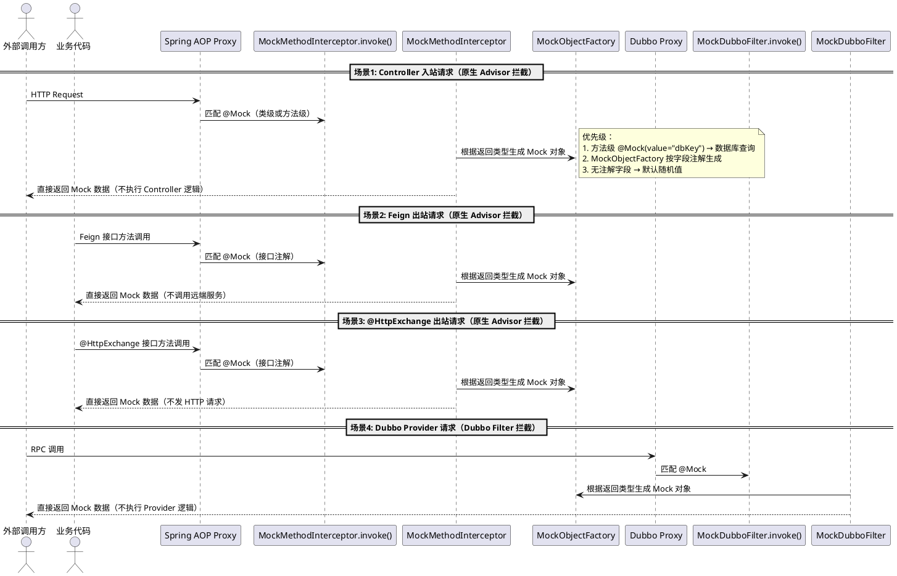
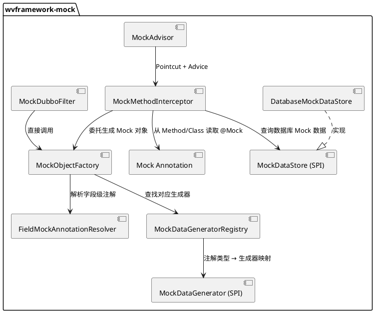

# wvframework-mock 数据 Mock 组件 - 开发设计文档

> **创建时间**: 2026-07-25  
> **技术栈**: Java 17+、Spring Boot 3.x、Spring AOP、Jackson

---

## 1 模块概述

### 1.1 模块名称

**wvframework-mock**（已有子模块，与 `wvframework-httplog`、`wvframework-crypto` 等并列）

### 1.2 模块定位

提供基于注解的**接口级数据 Mock** 能力，支持以下四种拦截场景：

1. **Controller 方法** — 外部请求该方法时，直接返回 Mock 数据，不执行业务逻辑
2. **Feign Client Facade 方法** — 远程调用时，不调用远端服务，直接返回 Mock 数据
3. **@HttpExchange 接口方法** — 声明式 HTTP 调用时，直接返回 Mock 数据
4. **Dubbo Provider 接口方法** — 服务提供方拦截，直接返回 Mock 数据

通过注解 **`@Mock`** 支持**类级**和**方法级**两种用法：
- **类级**：标注在 Controller 类上，表示该类所有请求方法都需要 Mock，作为运行时开关
- **方法级**：标注在具体请求方法上，更细粒度地控制该方法是否 Mock、Mock 请求体还是响应体等

同时通过**字段级语义 Mock 注解**（如 `@MockName`、`@MockIdCardNo`、`@MockAddress` 等）实现基于响应体字段类型的精细化 Mock 数据生成。

**核心设计理念**：

- **`@Mock` 运行时开关**：可标注在 `@Controller` 类或请求方法上。**类级标注**：表示该 Controller 所有请求方法都启用 Mock，作为运行时总开关；**方法级标注**：在类级基础上实现更细粒度的控制，可决定该方法是否 Mock、Mock 请求体还是响应体等。默认请求体和响应体都 Mock
- **字段级 `@MockXxx`**：标注在返回实体的属性上，根据字段语义（姓名、身份证、地址等）生成符合业务含义的 Mock 数据
- **默认 Mock 策略**：请求体和响应体字段都有默认 Mock 值。如果 String 类型字段没有任何 `@MockXxx` 注解，直接默认返回一个随机字符串；数值类型返回随机数，日期类型返回随机日期等
- **国际化支持**：字段级注解通过 `country` 属性控制生成的数据风格，针对不同国家的用户名、地址等字段生成对应语言风格的数据，兼容国际化通用处理
- **数据库 Mock 数据源**：支持从数据库读取预配置的 Mock 数据，通过 `@Mock(value = "dbKey")` 指定数据键。例如银行回调 Controller 接口，可配置一条默认银行回调成功的 Mock 数据，请求到达时直接从数据库取出返回

### 1.3 关联模块

| 关联方 | 说明 |
|--------|------|
| wvframework-core | 复用基础工具能力 |
| wvframework-annotations | 注解设计参考（`@EnumField`、`@Pojo` 等） |
| wvframework-httplog | 复用原生 Advisor 拦截机制（可选） |
| 业务应用 | 在 Controller 类或方法 / Feign / @HttpExchange / Dubbo Provider 方法上添加 `@Mock` 即可启用 |

---

## 2 功能要求

### 2.1 功能要求

| 编号 | 要求 | 说明 |
|------|------|------|
| F1 | `@Mock` 运行时开关注解（类 + 方法） | 可标注在类和方法上。类级：该类所有请求方法均启用 Mock；方法级：细粒度控制该方法的 Mock 行为（mockRequest/mockResponse/dbKey 等） |
| F2 | 字段级 Mock 注解体系 | 提供 `@MockName`、`@MockIdCardNo`、`@MockAddress`、`@MockPhone`、`@MockEmail` 等字段注解，标注在 DTO 属性上，根据字段语义生成 Mock 数据 |
| F3 | 国际化（Country）支持 | 字段级注解提供 `country` 属性，支持 `CN`（中国）、`US`（美国）、`JP`（日本）、`KR`（韩国）等，不同国家生成不同风格的 Mock 数据，兼容国际化通用处理 |
| F4 | 响应体自动解析与填充 | 根据方法返回类型，自动解析实体字段上的 Mock 注解，生成完整的 Mock 对象 |
| F5 | 集合类型支持 | 返回类型为 `List<T>`、`Page<T>` 等集合类型时，支持配置 Mock 数据条数 |
| F6 | 全局开关 | 支持全局配置开关（`wv.mock.enabled`），注解可覆盖全局配置 |
| F7 | Mock 数据生成策略可扩展 | 通过 SPI 接口 `MockDataGenerator` 支持自定义 Mock 数据生成策略 |
| F8 | Dubbo Provider 支持 | 通过 Dubbo Filter 机制拦截 Dubbo Provider 接口方法上的 `@Mock` 注解 |
| F9 | 默认 Mock 策略 | 字段若没有任何 `@MockXxx` 注解，String 类型默认返回随机字符串，数值类型返回随机数，日期类型返回随机日期等 |
| F10 | 数据库 Mock 数据源 | 支持从数据库读取预配置的 Mock 数据，通过 `@Mock(value = "dbKey")` 指定数据键，用于银行回调等需要固定 Mock 数据的场景 |
| F11 | 请求体 / 响应体分别控制 | 方法级 `@Mock` 可通过 `mockRequest` 和 `mockResponse` 属性分别控制是否 Mock 请求体和响应体，默认两者都 Mock |

### 2.2 非功能要求

| 项 | 要求 |
|----|------|
| 性能 | Mock 数据生成不应成为性能瓶颈；支持简单的缓存策略避免重复生成 |
| 线程安全 | Mock 数据生成器无状态设计，线程安全 |
| 扩展性 | 字段级 Mock 注解、数据生成策略均通过 SPI 接口扩展 |
| 兼容性 | 兼容 Spring MVC（Servlet）场景；Dubbo 场景兼容 Dubbo 3.x |

---

## 3 整体架构设计

### 3.1 模块内部结构

```
wvframework-mock/
└── src/main/java/com/github/walkvoid/wvframework/mock/
    ├── annotation/
    │   ├── Mock.java                              # 核心运行时开关注解（TYPE + METHOD）
    │   ├── MockName.java                          # 字段级：姓名
    │   ├── MockIdCardNo.java                      # 字段级：身份证号
    │   ├── MockAddress.java                       # 字段级：地址
    │   ├── MockPhone.java                         # 字段级：手机号
    │   ├── MockEmail.java                         # 字段级：邮箱
    │   ├── MockDate.java                          # 字段级：日期
    │   ├── MockNumber.java                        # 字段级：数值
    │   └── MockString.java                        # 字段级：通用字符串
    ├── enums/
    │   └── MockCountry.java                       # 国家枚举（CN/US/JP/KR/DEFAULT 等）
    ├── model/
    │   ├── MockProperties.java                    # 配置属性类
    │   └── MockDataEntity.java                    # 数据库 Mock 数据实体
    ├── generator/
    │   ├── MockDataGenerator.java                 # 数据生成器 SPI 接口
    │   ├── FieldMockAnnotationResolver.java       # 字段级注解解析器
    │   ├── MockObjectFactory.java                 # Mock 对象工厂（核心：反射 + 注解生成对象）
    │   └── impl/
    │       ├── NameMockDataGenerator.java         # 姓名生成器
    │       ├── IdCardNoMockDataGenerator.java     # 身份证号生成器
    │       ├── AddressMockDataGenerator.java      # 地址生成器
    │       ├── PhoneMockDataGenerator.java        # 手机号生成器
    │       ├── EmailMockDataGenerator.java        # 邮箱生成器
    │       ├── DateMockDataGenerator.java         # 日期生成器
    │       ├── NumberMockDataGenerator.java       # 数值生成器
    │       └── StringMockDataGenerator.java       # 通用字符串生成器（默认兜底）
    ├── store/
    │   ├── MockDataStore.java                     # Mock 数据源 SPI 接口
    │   ├── DatabaseMockDataStore.java             # 数据库实现
    │   └── MockDataStoreAutoConfiguration.java    # 数据源自动配置
    ├── advisor/
    │   ├── MockAdvisor.java                       # 原生 Advisor（Pointcut + Advice）
    │   └── MockMethodInterceptor.java             # 核心 MethodInterceptor（Controller/Feign/@HttpExchange）
    ├── dubbo/
    │   └── MockDubboFilter.java                   # Dubbo Filter（Dubbo Provider 场景拦截）
    ├── registry/
    │   └── MockDataGeneratorRegistry.java         # 生成器注册表（注解类型 → 生成器映射）
    ├── autoconfigure/
    │   └── MockAutoConfiguration.java             # Spring Boot 自动配置
    └── util/
        └── MockUtils.java                         # 工具类
```

### 3.2 核心拦截原理

本组件采用与 `wvframework-httplog` 相同的**原生 Advisor + MethodInterceptor** 机制，统一拦截 Controller、Feign、`@HttpExchange` 场景；Dubbo 场景通过独立的 **Dubbo Filter** 拦截。

**核心思路**：

1. 定义 `MockAdvisor`，Pointcut 匹配**类级别或方法级别**标注了 `@Mock` 的目标
2. `MockMethodInterceptor` 实现 `MethodInterceptor`，在 `invoke()` 中：
   - 优先从方法上获取 `@Mock` 注解；若方法上没有，再从类上获取
   - 检查 `enabled`、`mockRequest`、`mockResponse` 等属性
   - 若指定了 `value`（数据库 Mock 数据键），优先从 `MockDataStore` 查询数据库中的预配置 Mock 数据
   - 否则通过 `MockObjectFactory` 解析返回类型字段上的字段级 Mock 注解，生成 Mock 对象
   - 字段若没有任何 `@MockXxx` 注解，String 类型默认返回随机字符串
   - 直接返回 Mock 数据，**不执行原始业务逻辑**
3. Dubbo 场景通过 `MockDubboFilter`（实现 `org.apache.dubbo.rpc.Filter`）拦截 Provider 端方法

### 3.3 四种拦截场景流程图



### 3.4 核心组件关系



---

## 4 接口设计

### 4.0 任务接口映射表

| 任务ID | 任务名称 | 接口类型 | 接口章节 | 接口名称 | 备注 |
|--------|----------|----------|----------|----------|------|
| MOCK-001 | `@Mock` 运行时开关注解 | 注解 | 4.1 | `Mock` | 核心注解，支持类级和方法级 |
| MOCK-002 | 字段级 Mock 注解体系 | 注解 | 4.2 | `@MockName` / `@MockIdCardNo` / `@MockAddress` 等 | 字段语义级 Mock，无注解字段默认随机值 |
| MOCK-003 | Mock 数据生成器 SPI | SPI | 4.3 | `MockDataGenerator` / `MockDataGeneratorRegistry` | 可扩展生成策略 |
| MOCK-004 | Mock 对象工厂 | 核心引擎 | 4.4 | `MockObjectFactory` / `FieldMockAnnotationResolver` | 反射 + 注解解析 + 默认兜底 |
| MOCK-005 | 原生 Advisor + MethodInterceptor | 核心拦截器 | 4.5 | `MockAdvisor` / `MockMethodInterceptor` | 类级 + 方法级统一拦截 |
| MOCK-006 | Dubbo Filter | Dubbo 拦截器 | 4.6 | `MockDubboFilter` | Dubbo Provider 场景 |
| MOCK-007 | 自动配置与属性 | 配置 | 4.7 | `MockAutoConfiguration` / `MockProperties` | Spring Boot 集成 |
| MOCK-008 | Mock 数据源 SPI | SPI | 4.8 | `MockDataStore` / `DatabaseMockDataStore` | 数据库 Mock 数据存取 |

---

### 4.1 `@Mock` 运行时开关注解（关联任务：MOCK-001）

**类型**：注解  
**文件位置**：`wvframework-mock/src/main/java/.../mock/annotation/Mock.java`  
**关联任务**：MOCK-001

**注解说明**：

`@Mock` 是一个**运行时开关注解**，可标注在**类**和**方法**上，根据标注位置具有不同的语义：

| 属性 | 类型 | 默认值 | 类级语义 | 方法级语义 |
|------|------|--------|----------|------------|
| value | String | `""` | 忽略 | **数据库 Mock 数据键**，从数据库查询预配置 Mock 数据；为空则按字段注解自动生成 |
| enabled | boolean | `true` | 是否启用该类的 Mock（运行时开关） | 是否启用该方法的 Mock（可覆盖类级和全局开关） |
| mockRequest | boolean | `true` | 忽略 | 是否 Mock 请求体（入参） |
| mockResponse | boolean | `true` | 忽略 | 是否 Mock 响应体（返回值） |
| count | int | `1` | 忽略 | 集合类型返回值的 Mock 数据条数 |
| delay | long | `0` | 忽略 | 模拟延迟（毫秒） |

**目标（Target）**：`TYPE` + `METHOD`  
**保留策略**：`RUNTIME`

**类级与方法级的关系**：
- 类级 `@Mock` 表示该类所有请求方法都启用 Mock
- 方法级 `@Mock` 可覆盖类级配置（如类级启用但某个方法级禁用）
- 方法级 `@Mock` 提供更细粒度的控制（mockRequest/mockResponse/dbKey 等）

**代码示例**：

```java
/**
 * Mock 运行时开关注解（类 + 方法）
 * 文件位置：mock/annotation/Mock.java
 *
 * 标注在类上：该类所有请求方法均启用 Mock
 * 标注在方法上：细粒度控制该方法的 Mock 行为
 *
 * 类级：作为运行时开关，控制整个 Controller 的 Mock 启用
 * 方法级：可控制 mockRequest/mockResponse、指定数据库 Mock 数据键等
 */
@Target({ElementType.TYPE, ElementType.METHOD})
@Retention(RetentionPolicy.RUNTIME)
@Documented
public @interface Mock {

    /**
     * 方法级：数据库 Mock 数据键
     * 非空时优先从 MockDataStore 查询预配置 Mock 数据
     * 为空则按字段级 Mock 注解自动生成
     *
     * 类级：忽略
     */
    String value() default "";

    /** 是否启用 Mock（类级和方法级均有效） */
    boolean enabled() default true;

    /** 是否 Mock 请求体（仅方法级有效，默认 true） */
    boolean mockRequest() default true;

    /** 是否 Mock 响应体（仅方法级有效，默认 true） */
    boolean mockResponse() default true;

    /** 集合类型返回值的 Mock 数据条数（仅方法级有效） */
    int count() default 1;

    /** 模拟延迟（毫秒，仅方法级有效） */
    long delay() default 0;
}
```

**使用示例 — 类级（运行时开关）**：

```java
// ========== 示例1: 类级 @Mock — 整个 Controller 所有方法均 Mock ==========
@Mock
@RestController
@RequestMapping("/api/bank/callback")
public class BankCallbackController {

    @PostMapping("/notify")
    public Result<CallbackRespDTO> onCallbackNotify(@RequestBody CallbackReqDTO req) {
        // 此方法体不会被执行，直接返回 Mock 数据
        return bankService.handleCallback(req);
    }

    @PostMapping("/status")
    public Result<StatusRespDTO> queryStatus(@RequestBody StatusReqDTO req) {
        // 同样被 Mock，不执行
        return bankService.queryStatus(req);
    }
}

// ========== 示例2: 类级 @Mock + 方法级细粒度覆盖 ==========
@Mock
@RestController
@RequestMapping("/api/users")
public class UserController {

    // 继承类级 @Mock，所有方法默认 Mock
    @GetMapping("/{id}")
    public Result<UserInfoRespDTO> getUser(@PathVariable Long id) {
        return userService.getUser(id);
    }

    // 方法级覆盖：指定数据库 Mock 数据键 + 只 Mock 响应体
    @Mock(value = "user.list.default", mockRequest = false, count = 10)
    @GetMapping("/list")
    public Result<List<UserInfoRespDTO>> listUsers() {
        return userService.listUsers();
    }

    // 方法级覆盖：禁用该方法 Mock
    @Mock(enabled = false)
    @PostMapping("/create")
    public Result<Long> createUser(@RequestBody CreateUserReqDTO req) {
        // 该方法正常执行业务逻辑
        return userService.createUser(req);
    }
}
```

**使用示例 — 方法级（细粒度控制）**：

```java
// ========== 示例3: 仅方法级 @Mock — 指定数据库 Mock 数据 ==========
@RestController
@RequestMapping("/api/payment")
public class PaymentController {

    // 银行回调接口：从数据库读取预配置的"回调成功"Mock 数据
    @Mock(value = "bank.callback.success")
    @PostMapping("/bank/notify")
    public Result<BankCallbackRespDTO> onBankNotify(@RequestBody BankNotifyReqDTO req) {
        return paymentService.handleBankNotify(req);
    }

    // 普通 Mock：按字段注解自动生成
    @Mock
    @GetMapping("/order/{id}")
    public Result<OrderRespDTO> getOrder(@PathVariable Long id) {
        return paymentService.getOrder(id);
    }

    // 只 Mock 响应体，不 Mock 请求体
    @Mock(mockRequest = false)
    @PostMapping("/refund")
    public Result<RefundRespDTO> refund(@RequestBody RefundReqDTO req) {
        // 请求体正常处理，响应体返回 Mock 数据
        return paymentService.refund(req);
    }
}

// ========== 示例4: 标注在 Feign Client 方法上 ==========
@FeignClient(name = "user-service", path = "/api/users")
public interface UserFeignClient {

    @Mock
    @GetMapping("/{id}")
    Result<UserDTO> getUserById(@PathVariable("id") Long id);
}

// ========== 示例5: 标注在 @HttpExchange 接口方法上 ==========
@HttpExchange(url = "http://user-service/api/users")
public interface UserHttpApi {

    @Mock
    @GetExchange("/{id}")
    Result<UserDTO> getUserById(@PathVariable("id") Long id);
}

// ========== 示例6: 标注在 Dubbo Provider 接口上 ==========
@DubboService
public class UserServiceProvider implements UserService {

    @Mock
    @Override
    public Result<UserDTO> getUserById(Long id) {
        // 此方法体不会被执行
        return userService.getUserById(id);
    }
}
```

---

### 4.2 字段级 Mock 注解体系（关联任务：MOCK-002）

**类型**：注解  
**文件位置**：`wvframework-mock/src/main/java/.../mock/annotation/`  
**关联任务**：MOCK-002

**设计说明**：

字段级注解标注在 DTO / VO 实体的属性上，根据字段的业务语义随机生成 Mock 数据。每个语义级注解提供 `country` 属性，支持按国家/地区生成不同风格的数据，兼容国际化通用处理。

**默认 Mock 策略**：如果字段**没有任何 `@MockXxx` 注解**，框架根据字段类型提供默认的随机值：

| 字段类型 | 默认 Mock 值 |
|----------|-------------|
| `String` | 随机字符串（8~16 位，含字母和数字） |
| `int` / `Integer` | 随机整数（0~10000） |
| `long` / `Long` | 随机长整数（0~1000000） |
| `double` / `Double` | 随机浮点数（0.0~10000.0） |
| `boolean` / `Boolean` | 随机布尔值 |
| `BigDecimal` | 随机金额（0.00~10000.00，保留 2 位小数） |
| `Date` / `LocalDateTime` / `LocalDate` | 随机日期（近一年内） |
| 枚举类型 | 随机选取一个枚举值 |
| 复杂对象 | 递归处理内部字段 |

#### `MockCountry`（国家枚举）

| 值 | 说明 |
|----|------|
| CN | 中国 |
| US | 美国 |
| JP | 日本 |
| KR | 韩国 |
| DEFAULT | 默认（等同 CN） |

#### `@MockName`（姓名）

| 属性 | 类型 | 默认值 | 说明 |
|------|------|--------|------|
| country | MockCountry | `CN` | 国家，CN 生成中文姓名，US 生成英文姓名，JP 生成日文姓名，KR 生成韩文姓名 |

```java
public class UserInfoRespDTO {

    @MockName(country = MockCountry.CN)   // 生成如 "张三"、"李四"
    private String username;

    @MockName(country = MockCountry.US)   // 生成如 "John Smith"
    private String englishName;

    @MockName(country = MockCountry.JP)   // 生成如 "田中太郎"
    private String japaneseName;

    @MockName(country = MockCountry.KR)   // 生成如 "김민수"
    private String koreanName;
}
```

#### `@MockIdCardNo`（身份证号）

| 属性 | 类型 | 默认值 | 说明 |
|------|------|--------|------|
| country | MockCountry | `CN` | 国家，CN 生成 18 位身份证号，US 生成 SSN 格式 |

#### `@MockAddress`（地址）

| 属性 | 类型 | 默认值 | 说明 |
|------|------|--------|------|
| country | MockCountry | `CN` | 国家，CN 生成中国省市区地址，US 生成美国地址，JP 生成日本地址 |

```java
public class UserInfoRespDTO {

    @MockAddress(country = MockCountry.CN)
    // 生成如 "浙江省杭州市西湖区文三路 100 号"
    private String address;
}

public class UserUsDTO {

    @MockAddress(country = MockCountry.US)
    // 生成如 "123 Main St, Springfield, IL 62701"
    private String address;
}

public class UserJpDTO {

    @MockAddress(country = MockCountry.JP)
    // 生成如 "東京都渋谷区道玄坂1-2-3"
    private String address;
}
```

#### `@MockPhone`（手机号）

| 属性 | 类型 | 默认值 | 说明 |
|------|------|--------|------|
| country | MockCountry | `CN` | 国家，CN 生成 11 位手机号，US 生成美国手机号，JP 生成日本手机号 |

#### `@MockEmail`（邮箱）

| 属性 | 类型 | 默认值 | 说明 |
|------|------|--------|------|
| domain | String | `""` | 指定邮箱域名，为空则随机生成 |

#### `@MockDate`（日期）

| 属性 | 类型 | 默认值 | 说明 |
|------|------|--------|------|
| pattern | String | `"yyyy-MM-dd"` | 日期格式 |
| start | String | `""` | 起始日期（含），为空则不限制 |
| end | String | `""` | 结束日期（含），为空则不限制 |

#### `@MockNumber`（数值）

| 属性 | 类型 | 默认值 | 说明 |
|------|------|--------|------|
| min | long | `0` | 最小值 |
| max | long | `10000` | 最大值 |

#### `@MockString`（通用字符串）

| 属性 | 类型 | 默认值 | 说明 |
|------|------|--------|------|
| prefix | String | `""` | 前缀 |
| length | int | `10` | 字符串长度 |

**完整使用示例**：

```java
/**
 * 用户信息响应 DTO
 * 文件位置：业务模块 DTO
 *
 * 字段上标注不同的 Mock 注解，MockObjectFactory 自动解析并生成 Mock 数据
 * 没有标注任何 @MockXxx 的 String 字段，默认返回随机字符串
 */
public class UserInfoRespDTO {

    @MockName(country = MockCountry.CN)
    private String username;          // Mock: "张三"

    @MockIdCardNo(country = MockCountry.CN)
    private String idCardNo;          // Mock: "330106199001011234"

    @MockPhone(country = MockCountry.CN)
    private String phone;             // Mock: "13800138000"

    @MockAddress(country = MockCountry.CN)
    private String address;           // Mock: "浙江省杭州市西湖区文三路 100 号"

    @MockEmail
    private String email;             // Mock: "abc123@qq.com"

    @MockDate(pattern = "yyyy-MM-dd HH:mm:ss")
    private LocalDateTime createTime; // Mock: "2026-01-15 10:30:00"

    @MockNumber(min = 1, max = 100)
    private Integer age;              // Mock: 25

    // 没有任何 @MockXxx 注解的 String 字段 → 默认随机字符串
    private String remark;            // Mock: "a3Kf9xQm"（随机串）

   // 没有任何 @MockXxx 注解的 Long 字段 → 默认随机数
    private Long score;               // Mock: 583920（随机数）
}
```

<!-- APPEND_MARKER_1 -->

---

### 4.3 Mock 数据生成器 SPI（关联任务：MOCK-003）

**类型**：SPI 接口 + 注册表 + 内置实现  
**文件位置**：`wvframework-mock/src/main/java/.../mock/generator/`  
**关联任务**：MOCK-003

#### `MockDataGenerator<T>`（SPI 接口）

```java
/**
 * Mock 数据生成器 SPI 接口
 * 文件位置：mock/generator/MockDataGenerator.java
 *
 * @param <T> 生成的数据类型
 */
public interface MockDataGenerator<T> {

    /**
     * 生成 Mock 数据
     * @param country 国家/地区
     * @return 生成的 Mock 数据
     */
    T generate(MockCountry country);
}
```

#### `MockDataGeneratorRegistry`（注册表）

```java
/**
 * 生成器注册表：注解类型 → 生成器实例
 * 文件位置：mock/registry/MockDataGeneratorRegistry.java
 *
 * Spring Boot 启动时自动发现所有 MockDataGenerator Bean 并注册
 */
public class MockDataGeneratorRegistry {

    // Class<? extends Annotation> → MockDataGenerator<?>
    private final Map<Class<? extends Annotation>, MockDataGenerator<?>> generatorMap = new ConcurrentHashMap<>();

    public void register(Class<? extends Annotation> annotationType, MockDataGenerator<?> generator) {
        generatorMap.put(annotationType, generator);
    }

    public MockDataGenerator<?> getGenerator(Class<? extends Annotation> annotationType) {
        return generatorMap.get(annotationType);
    }

    public boolean hasGenerator(Class<? extends Annotation> annotationType) {
        return generatorMap.containsKey(annotationType);
    }
}
```

#### 内置生成器实现

| 生成器 | 对应注解 | 生成示例（CN） | 生成示例（US） |
|--------|----------|---------------|---------------|
| `NameMockDataGenerator` | `@MockName` | "张三" | "John Smith" |
| `IdCardNoMockDataGenerator` | `@MockIdCardNo` | "330106199001011234" | "123-45-6789" |
| `AddressMockDataGenerator` | `@MockAddress` | "浙江省杭州市西湖区文三路 100 号" | "123 Main St, Springfield, IL 62701" |
| `PhoneMockDataGenerator` | `@MockPhone` | "13800138000" | "+1 (202) 555-0123" |
| `EmailMockDataGenerator` | `@MockEmail` | "abc123@qq.com" | "john.doe@gmail.com" |
| `DateMockDataGenerator` | `@MockDate` | "2026-03-15" | "2026-03-15" |
| `NumberMockDataGenerator` | `@MockNumber` | 42 | 42 |
| `StringMockDataGenerator` | `@MockString` | "a3Kf9xQm7b" | "a3Kf9xQm7b" |

**默认兜底生成器**：当字段没有任何 `@MockXxx` 注解时，`MockObjectFactory` 使用内置的默认类型生成策略：

```java
/**
 * 默认类型生成策略（无 @MockXxx 注解时使用）
 * 文件位置：mock/generator/impl/DefaultTypeGenerator.java
 */
public class DefaultTypeGenerator {

    public static Object generate(Class<?> type) {
        if (type == String.class) {
            // 随机字符串 8~16 位，含字母和数字
            return RandomStringUtils.randomAlphanumeric(8, 16);
        } else if (type == int.class || type == Integer.class) {
            return ThreadLocalRandom.current().nextInt(0, 10001);
        } else if (type == long.class || type == Long.class) {
            return ThreadLocalRandom.current().nextLong(0, 1000001L);
        } else if (type == double.class || type == Double.class) {
            return ThreadLocalRandom.current().nextDouble(0.0, 10000.0);
        } else if (type == boolean.class || type == Boolean.class) {
            return ThreadLocalRandom.current().nextBoolean();
        } else if (type == BigDecimal.class) {
            return BigDecimal.valueOf(ThreadLocalRandom.current().nextDouble(0.0, 10000.0))
                    .setScale(2, RoundingMode.HALF_UP);
        } else if (type == Date.class || type == LocalDateTime.class || type == LocalDate.class) {
            return generateRandomDate();
        } else if (type.isEnum()) {
            Object[] constants = type.getEnumConstants();
            return constants[ThreadLocalRandom.current().nextInt(constants.length)];
        }
        return null;
    }
}
```

---

### 4.4 Mock 对象工厂（关联任务：MOCK-004）

**类型**：核心引擎  
**文件位置**：`wvframework-mock/src/main/java/.../mock/generator/MockObjectFactory.java`  
**关联任务**：MOCK-004

#### `MockObjectFactory`

```java
/**
 * Mock 对象工厂：根据返回类型 + 字段级注解，反射生成 Mock 对象
 * 文件位置：mock/generator/MockObjectFactory.java
 *
 * 核心流程：
 * 1. 解析返回类型的泛型参数
 * 2. 反射创建实例
 * 3. 遍历字段，查找 @MockXxx 注解
 * 4. 有注解 → 从 Registry 查找生成器
 * 5. 无注解 → 使用 DefaultTypeGenerator 默认策略
 * 6. 嵌套复杂对象递归处理（最大深度 3 层）
 */
public class MockObjectFactory {

    private final MockDataGeneratorRegistry registry;
    private static final int MAX_DEPTH = 3;

    public MockObjectFactory(MockDataGeneratorRegistry registry) {
        this.registry = registry;
    }

    /**
     * 根据返回类型生成 Mock 对象
     */
    public Object createMockObject(Type returnType, MockCountry country, int count) {
        Class<?> rawType = resolveRawType(returnType);
        // 集合类型：生成 count 个元素
        if (Collection.class.isAssignableFrom(rawType)) {
            Type elementType = resolveGenericType(returnType);
            return createCollection(rawType, elementType, country, count);
        }
        return createInstance(rawType, country, 0);
    }

    /**
     * 创建单个对象实例
     */
    private Object createInstance(Class<?> type, MockCountry country, int depth) {
        if (depth > MAX_DEPTH) return null;
        // 基本类型 / 包装类型 / String → 默认值
        if (isSimpleType(type)) {
            return DefaultTypeGenerator.generate(type);
        }
        Object instance = instantiate(type);
        for (Field field : getAllFields(type)) {
            field.setAccessible(true);
            Object value = resolveFieldValue(field, country, depth);
            if (value != null) {
                field.set(instance, value);
            }
        }
        return instance;
    }

    /**
     * 解析字段值：优先 @MockXxx 注解 → 默认类型生成
     */
    private Object resolveFieldValue(Field field, MockCountry country, int depth) {
        // 查找字段上的 Mock 注解
        Annotation mockAnnotation = FieldMockAnnotationResolver.resolve(field);
        if (mockAnnotation != null) {
            MockDataGenerator<?> generator = registry.getGenerator(mockAnnotation.annotationType());
            if (generator != null) {
                return generator.generate(country);
            }
        }
        // 无注解 → 默认类型生成
        return DefaultTypeGenerator.generate(field.getType());
    }
}
```

#### `FieldMockAnnotationResolver`

```java
/**
 * 字段级 Mock 注解解析器
 * 文件位置：mock/generator/FieldMockAnnotationResolver.java
 *
 * 扫描字段上的所有注解，返回第一个已注册的 Mock 注解
 */
public class FieldMockAnnotationResolver {

    private static final Set<Class<? extends Annotation>> MOCK_ANNOTATIONS = Set.of(
        MockName.class, MockIdCardNo.class, MockAddress.class,
        MockPhone.class, MockEmail.class, MockDate.class,
        MockNumber.class, MockString.class
    );

    public static Annotation resolve(Field field) {
        for (Class<? extends Annotation> annoType : MOCK_ANNOTATIONS) {
            Annotation anno = field.getAnnotation(annoType);
            if (anno != null) return anno;
        }
        return null;  // 无 Mock 注解 → 使用默认策略
    }
}
```

---

### 4.5 原生 Advisor + MethodInterceptor（关联任务：MOCK-005）

**类型**：核心拦截器  
**文件位置**：`wvframework-mock/src/main/java/.../mock/advisor/`  
**关联任务**：MOCK-005

#### `MockAdvisor`

```java
/**
 * Mock Advisor：组合类级 + 方法级 Pointcut
 * 文件位置：mock/advisor/MockAdvisor.java
 *
 * 使用 ComposablePointcut 组合：
 * - ClassFilter：匹配类上有 @Mock 的
 * - MethodMatcher：匹配方法上有 @Mock 的
 */
public class MockAdvisor extends AbstractPointcutAdvisor {

    private final Pointcut pointcut;
    private final MethodInterceptor interceptor;

    public MockAdvisor(MethodInterceptor interceptor) {
        this.interceptor = interceptor;
        // 组合类级 + 方法级匹配
        ComposablePointcut cp = new ComposablePointcut(ClassFilter.TRUE);
        // 类级 @Mock
        cp.union(new AnnotationMatchingPointcut(Mock.class, true));
        // 方法级 @Mock
        cp.union(new AnnotationMatchingPointcut(null, Mock.class));
        this.pointcut = cp;
    }

    @Override
    public Pointcut getPointcut() {
        return this.pointcut;
    }

    @Override
    public Advice getAdvice() {
        return this.interceptor;
    }
}
```

#### `MockMethodInterceptor`

```java
/**
 * Mock 方法拦截器：拦截 Controller / Feign / @HttpExchange 方法
 * 文件位置：mock/advisor/MockMethodInterceptor.java
 *
 * 核心逻辑：
 * 1. 从方法获取 @Mock，其次从类获取
 * 2. 检查 enabled
 * 3. 检查 value（数据库 Mock 数据键）→ 优先查 MockDataStore
 * 4. 否则 MockObjectFactory 按字段注解生成
 * 5. 不执行 invocation.proceed()
 */
public class MockMethodInterceptor implements MethodInterceptor {

    private final MockObjectFactory mockObjectFactory;
    private final MockDataStore mockDataStore;  // 可选，nullable
    private final MockProperties properties;

    @Override
    public Object invoke(MethodInvocation invocation) throws Throwable {
        Method method = invocation.getMethod();
        // 1. 解析 @Mock 注解（方法级 > 类级）
        Mock mock = resolveMockAnnotation(method);
        if (mock == null || !mock.enabled()) return invocation.proceed();

        // 2. 全局开关检查
        if (!properties.isEnabled()) return invocation.proceed();

        // 3. 延迟模拟
        if (mock.delay() > 0) {
            Thread.sleep(mock.delay());
        }

        // 4. 数据库 Mock 数据优先
        if (StringUtils.hasText(mock.value()) && mockDataStore != null) {
            String jsonData = mockDataStore.getMockData(mock.value());
            if (jsonData != null) {
                return deserializeMockData(jsonData, method.getGenericReturnType());
            }
            // 降级为 MockObjectFactory 自动生成
        }

        // 5. MockObjectFactory 按字段注解生成
        MockCountry country = properties.getDefaultCountry();
        return mockObjectFactory.createMockObject(
            method.getGenericReturnType(), country, mock.count()
        );
    }

    private Mock resolveMockAnnotation(Method method) {
        // 方法级优先
        Mock mock = AnnotatedElementUtils.findMergedAnnotation(method, Mock.class);
        if (mock != null) return mock;
        // 类级兜底
        return AnnotatedElementUtils.findMergedAnnotation(method.getDeclaringClass(), Mock.class);
    }
}
```

---

### 4.6 Dubbo Filter（关联任务：MOCK-006）

**类型**：Dubbo 拦截器  
**文件位置**：`wvframework-mock/src/main/java/.../mock/dubbo/MockDubboFilter.java`  
**关联任务**：MOCK-006

```java
/**
 * Dubbo Mock Filter：拦截 Provider 端方法上的 @Mock 注解
 * 文件位置：mock/dubbo/MockDubboFilter.java
 *
 * 通过 @Activate(group = "provider") 确保仅在 Provider 端生效
 */
@Activate(group = "provider")
public class MockDubboFilter implements Filter {

    private final MockObjectFactory mockObjectFactory;
    private final MockProperties properties;

    @Override
    public Result invoke(Invoker<?> invoker, Invocation invocation) throws RpcException {
        if (!properties.isEnabled()) {
            return invoker.invoke(invocation);
        }

        // 查找 @Mock 注解（方法级 > 类级）
        Method method = findMethod(invoker, invocation);
        Mock mock = resolveMockAnnotation(method);
        if (mock == null || !mock.enabled()) {
            return invoker.invoke(invocation);
        }

        // 生成 Mock 数据
        Object mockResult = mockObjectFactory.createMockObject(
            method.getGenericReturnType(),
            properties.getDefaultCountry(),
            mock.count()
        );
        return AsyncRpcResult.newResult(mockResult);
    }

    private Mock resolveMockAnnotation(Method method) {
        if (method == null) return null;
        Mock mock = method.getAnnotation(Mock.class);
        if (mock != null) return mock;
        return method.getDeclaringClass().getAnnotation(Mock.class);
    }
}
```

**SPI 注册文件**：`META-INF/dubbo/org.apache.dubbo.rpc.Filter`

```
mockFilter=com.github.walkvoid.wvframework.mock.dubbo.MockDubboFilter
```

---

### 4.7 自动配置与属性（关联任务：MOCK-007）

**类型**：Spring Boot 配置  
**文件位置**：
- `.../mock/model/MockProperties.java`
- `.../mock/autoconfigure/MockAutoConfiguration.java`
**关联任务**：MOCK-007

#### 配置属性

```yaml
wv:
  mock:
    enabled: true                    # 全局开关
    default-count: 1                 # 默认集合数据条数（注解 count 优先）
    scan-packages:                   # 额外扫描的包路径（字段级注解扫描范围）
      - com.github.walkvoid
    dubbo:
      enabled: true                  # Dubbo Filter 开关
    store:
      enabled: true                  # 数据库 Mock 数据源开关
      table: wv_mock_data            # Mock 数据表名
```

#### 自动配置类

```java
/**
 * Mock 自动配置
 * 文件位置：mock/autoconfigure/MockAutoConfiguration.java
 *
 * 核心逻辑：
 * 1. 读取 wv.mock.* 配置
 * 2. 注册 MockDataGeneratorRegistry 并自动发现所有 MockDataGenerator Bean
 * 3. 注册 MockObjectFactory
 * 4. 注册 MockAdvisor（统一拦截 Controller + Feign + @HttpExchange）
 * 5. 条件注册 MockDataStore（数据库 Mock 数据源）
 * 6. 条件注册 MockDubboFilter（Dubbo 场景）
 */
@Configuration
@ConditionalOnProperty(name = "wv.mock.enabled", havingValue = "true", matchIfMissing = true)
@EnableConfigurationProperties(MockProperties.class)
public class MockAutoConfiguration {

    @Bean
    @ConditionalOnMissingBean
    public MockDataGeneratorRegistry mockDataGeneratorRegistry(
            ObjectProvider<List<MockDataGenerator<?>>> generatorProvider) {
        MockDataGeneratorRegistry registry = new MockDataGeneratorRegistry();
        registerBuiltinGenerators(registry);
        List<MockDataGenerator<?>> generators = generatorProvider.getIfAvailable();
        if (generators != null) {
            generators.forEach(registry::register);
        }
        return registry;
    }

    @Bean
    @ConditionalOnMissingBean
    public FieldMockAnnotationResolver fieldMockAnnotationResolver(MockDataGeneratorRegistry registry) {
        return new FieldMockAnnotationResolver(registry);
    }

    @Bean
    @ConditionalOnMissingBean
    public MockObjectFactory mockObjectFactory(MockDataGeneratorRegistry registry,
                                                FieldMockAnnotationResolver resolver) {
        return new MockObjectFactory(registry, resolver);
    }

    @Bean
    @Role(BeanDefinition.ROLE_INFRASTRUCTURE)
    public MockAdvisor mockAdvisor(MockObjectFactory factory, MockDataStore dataStore, MockProperties properties) {
        return new MockAdvisor(new MockMethodInterceptor(factory, dataStore, properties));
    }

    // 数据库 Mock 数据源条件注册
    @Bean
    @ConditionalOnProperty(name = "wv.mock.store.enabled", havingValue = "true", matchIfMissing = true)
    @ConditionalOnBean(DataSource.class)
    @ConditionalOnMissingBean
    public MockDataStore mockDataStore(DataSource dataSource, MockProperties properties) {
        return new DatabaseMockDataStore(dataSource, properties);
    }

    // Dubbo Filter 条件注册
    @Bean
    @ConditionalOnClass(name = "org.apache.dubbo.rpc.Filter")
    @ConditionalOnProperty(name = "wv.mock.dubbo.enabled", havingValue = "true", matchIfMissing = true)
    public MockDubboFilter mockDubboFilter(MockObjectFactory factory, MockDataStore dataStore, MockProperties properties) {
        return new MockDubboFilter(factory, dataStore, properties);
    }

    private void registerBuiltinGenerators(MockDataGeneratorRegistry registry) {
        registry.register(new NameMockDataGenerator());
        registry.register(new IdCardNoMockDataGenerator());
        registry.register(new AddressMockDataGenerator());
        registry.register(new PhoneMockDataGenerator());
        registry.register(new EmailMockDataGenerator());
        registry.register(new DateMockDataGenerator());
        registry.register(new NumberMockDataGenerator());
        registry.register(new StringMockDataGenerator());
    }
}
```

**META-INF/spring/org.springframework.boot.autoconfigure.AutoConfiguration.imports** 中注册 `MockAutoConfiguration`。

---

### 4.8 Mock 数据源 SPI（关联任务：MOCK-008）

**类型**：SPI 接口 + 数据库实现  
**文件位置**：`wvframework-mock/src/main/java/.../mock/store/`  
**关联任务**：MOCK-008

**设计说明**：

支持从数据库读取预配置的 Mock 数据。典型场景：银行回调接口需要返回固定的"回调成功"Mock 数据，通过 `@Mock(value = "bank.callback.success")` 指定数据键，框架从数据库查询对应的 JSON 数据并反序列化返回。

| 接口/类 | 职责 |
|---------|------|
| `MockDataStore` | Mock 数据源 SPI 接口，定义 `getMockData(String key)` 方法 |
| `DatabaseMockDataStore` | 数据库实现，从 `wv_mock_data` 表读取 Mock 数据 |

**代码示例**：

```java
/**
 * Mock 数据源 SPI 接口
 * 文件位置：mock/store/MockDataStore.java
 *
 * 支持从不同来源获取预配置的 Mock 数据
 * 默认实现为数据库，业务方可自定义实现（如从 Redis、配置文件读取）
 */
public interface MockDataStore {

    /**
     * 根据数据键获取预配置的 Mock 数据
     * @param key 数据键（如 "bank.callback.success"）
     * @return Mock 数据的 JSON 字符串，未找到返回 null
     */
    String getMockData(String key);
}
```

```java
/**
 * 数据库 Mock 数据源实现
 * 文件位置：mock/store/DatabaseMockDataStore.java
 *
 * 核心逻辑：
 * 1. 从 wv_mock_data 表查询 mock_key 对应的 mock_data
 * 2. 支持缓存（简单内存缓存，避免每次查询数据库）
 * 3. 未找到返回 null，降级为 MockObjectFactory 自动生成
 */
public class DatabaseMockDataStore implements MockDataStore {

    private final JdbcTemplate jdbcTemplate;
    private final MockProperties properties;
    private final Map<String, String> cache = new ConcurrentHashMap<>();

    @Override
    public String getMockData(String key) {
        // 先查缓存
        String cached = cache.get(key);
        if (cached != null) {
            return cached;
        }

        // 查数据库
        String tableName = properties.getStore().getTable();
        String sql = "SELECT mock_data FROM " + tableName
                   + " WHERE mock_key = ? AND enabled = 1 LIMIT 1";
        List<String> results = jdbcTemplate.queryForList(sql, String.class, key);

        if (!results.isEmpty()) {
            String data = results.get(0);
            cache.put(key, data);
            return data;
        }
        return null;
    }
}
```

**使用示例**：

```java
// 银行回调 Controller：从数据库读取预配置的"回调成功"Mock 数据
@RestController
@RequestMapping("/api/payment")
public class PaymentController {

    /**
     * 银行回调通知接口
     * value = "bank.callback.success" 对应 wv_mock_data 表中的 mock_key
     * 当请求到达时，框架从数据库查询该 key 对应的 JSON 数据直接返回
     */
    @Mock(value = "bank.callback.success")
    @PostMapping("/bank/notify")
    public Result<BankCallbackRespDTO> onBankNotify(@RequestBody BankNotifyReqDTO req) {
        // 不执行业务逻辑，直接返回数据库中配置的 Mock 数据
        return paymentService.handleBankNotify(req);
    }
}
```

对应数据库表数据示例：

```sql
INSERT INTO wv_mock_data (mock_key, mock_data, description, enabled)
VALUES (
    'bank.callback.success',
    '{"code":"0000","msg":"success","data":{"transactionId":"TXN202607250001","status":"SUCCESS","amount":10000.00}}',
    '银行回调成功Mock数据',
    1
);
```
